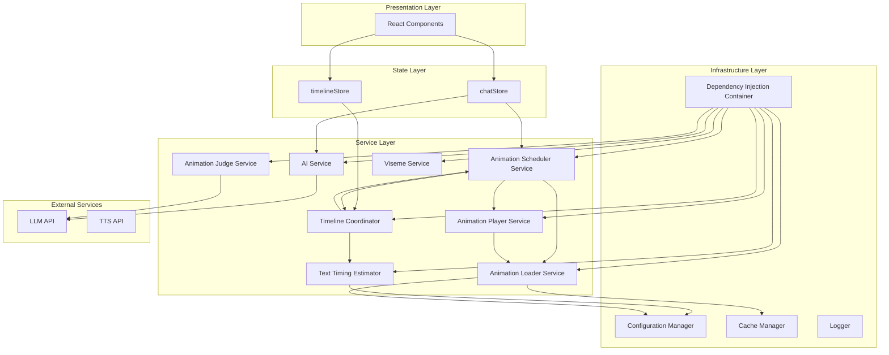
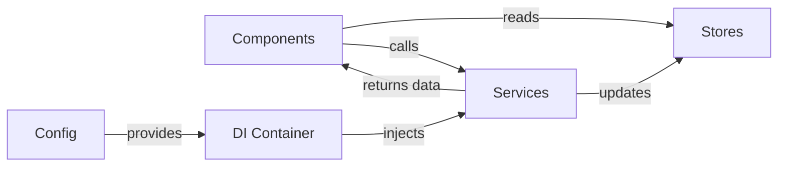

# Architecture Refactoring Plan

## Executive Summary

This document outlines a comprehensive refactoring strategy to address critical architectural issues identified in the 3D Chat application. The primary focus is eliminating God Classes, separating concerns, fixing circular dependencies, and making services testable by removing business logic from stores.

**Critical Issues Addressed:**
- God Classes with 800+ lines of mixed responsibilities
- Circular dependencies and initialization anti-patterns
- Business logic leakage into stores
- Deprecated code still in use
- Hardcoded configuration mixed with logic

---

## 1. Refactoring Strategy

### 1.1 Approach: Incremental Refactoring

**Decision: Incremental refactoring with feature flags**

Rationale:
- **Big bang refactoring** is too risky for a production application
- **Incremental approach** allows continuous testing and validation
- **Feature flags** enable safe rollbacks
- Each phase delivers working, testable code

### 1.2 Refactoring Principles

1. **Single Responsibility Principle** - Each service has one clear purpose
2. **Dependency Inversion** - Depend on abstractions, not concrete implementations
3. **Interface Segregation** - Small, focused interfaces
4. **Dependency Injection** - No hardcoded dependencies
5. **Testability First** - Services testable without stores or UI

### 1.3 Success Criteria

- All services unit testable in isolation
- No circular dependencies
- Stores contain only state, no business logic
- All deprecated code removed
- Configuration externalized to JSON/config files
- Zero breaking changes to public API

---

## 2. Target Architecture

### 2.1 Architecture Overview



### 2.2 Layer Responsibilities

| Layer | Responsibilities | Should NOT Contain |
|--------|----------------|---------------------|
| **Presentation** | UI rendering, user interaction | Business logic, state management |
| **State (Stores)** | State storage, state accessors | Business logic, API calls, calculations |
| **Service** | Business logic, API integration, orchestration | UI code, direct DOM manipulation |
| **Infrastructure** | Cross-cutting concerns (logging, config, DI) | Business logic, domain rules |

### 2.3 Dependency Flow



**Key Rules:**
- Services NEVER directly access stores
- Services return data, components update stores
- Components read from stores, call services
- DI container manages all service lifecycles

---

## 3. Service Splitting Plan

### 3.1 AnimationJudgeService (856 lines → ~200 lines)

**Current Responsibilities:**
1. LLM API integration
2. Animation selection logic
3. Queue processing
4. Duration management (hardcoded)
5. Timing distribution
6. Layer suggestion
7. Enhanced judgment logic

**Split Into:**

#### 3.1.1 AnimationJudgeService (NEW)
**Purpose:** LLM-based animation selection

**Responsibilities:**
- Call LLM API with conversation context
- Parse LLM response for animation selections
- Return animation judgment data

**Interface:**
```typescript
interface IAnimationJudge {
  judge(userMessage: string, aiResponse: string): Promise<AnimationJudgment>;
  judgeWithTiming(userMessage: string, aiResponse: string): Promise<AnimationJudgmentWithTiming>;
}
```

**Dependencies:**
- `ILLMClient` - For API calls
- `IAnimationConfig` - For available animations

#### 3.1.2 AnimationTimingDistributor (NEW)
**Purpose:** Calculate animation timing across audio

**Responsibilities:**
- Distribute animations across timeline
- Apply timing strategies (early, middle, late, distributed)
- Calculate trigger times

**Interface:**
```typescript
interface IAnimationTimingDistributor {
  distribute(animations: AnimationTrigger[], audioDuration: number, strategy: TimingStrategy): ScheduledAnimation[];
}
```

**Dependencies:**
- `IAnimationDurationProvider` - For animation durations

#### 3.1.3 AnimationDurationService (NEW)
**Purpose:** Provide animation durations

**Responsibilities:**
- Load animation durations from config
- Provide duration lookup
- Handle fallback for unknown animations

**Interface:**
```typescript
interface IAnimationDurationProvider {
  getDuration(animationName: string): number;
  getDefaultDuration(): number;
}
```

**Dependencies:**
- `IConfiguration` - For duration data

#### 3.1.4 AnimationLayerSuggester (NEW)
**Purpose:** Suggest animation layers based on animation type

**Responsibilities:**
- Analyze animation type
- Suggest appropriate layer (full_body, upper_body, etc.)

**Interface:**
```typescript
interface IAnimationLayerSuggester {
  suggestLayer(animationName: string): AnimationLayerType;
}
```

**Dependencies:**
- `IAnimationConfig` - For animation categories

**Migration Strategy:**
1. Create new services with interfaces
2. Extract duration data to config file
3. Update AnimationJudgeService to use new services
4. Add feature flag to switch between old/new implementations
5. Gradually migrate callers to use new services
6. Deprecate old AnimationJudgeService methods

---

### 3.2 VRMAAnimationService (818 lines → ~300 lines)

**Current Responsibilities:**
1. Animation file loading
2. Caching
3. Retargeting
4. Priority-based loading
5. Retry logic
6. Texture error handling
7. Bone masking (deprecated)
8. State management
9. Batch processing

**Split Into:**

#### 3.2.1 AnimationLoaderService (NEW)
**Purpose:** Load animation files from disk/network

**Responsibilities:**
- Load VRMA files
- Parse animation data
- Handle loading errors

**Interface:**
```typescript
interface IAnimationLoader {
  load(config: AnimationConfig): Promise<AnimationData>;
  loadBatch(configs: AnimationConfig[]): Promise<Map<string, AnimationData>>;
}
```

**Dependencies:**
- `ICache` - For caching loaded animations
- `ILogger` - For error logging

#### 3.2.2 AnimationRetargetingService (NEW)
**Purpose:** Retarget animations to specific VRM models

**Responsibilities:**
- Retarget animation clips to VRM
- Apply bone masking if needed
- Cache retargeted clips per model

**Interface:**
```typescript
interface IAnimationRetargeter {
  retarget(animation: VRMAnimation, vrm: VRM, modelId: string): THREE.AnimationClip;
  clearCacheForModel(modelId: string): void;
}
```

**Dependencies:**
- `ICache` - For retargeted clip cache
- `IBoneMaskProvider` - For bone masking (if needed)

#### 3.2.3 AnimationCacheService (NEW)
**Purpose:** Manage animation caching

**Responsibilities:**
- Cache loaded animations
- Cache retargeted clips
- Handle cache invalidation
- Track cache statistics

**Interface:**
```typescript
interface IAnimationCache {
  get(key: string): AnimationData | undefined;
  set(key: string, value: AnimationData): void;
  has(key: string): boolean;
  clear(): void;
  clearForModel(modelId: string): void;
}
```

**Dependencies:**
- None (pure cache implementation)

#### 3.2.4 AnimationPriorityLoader (NEW)
**Purpose:** Load animations by priority tier

**Responsibilities:**
- Load CRITICAL animations first
- Load HIGH priority in background
- Load MEDIUM/LOW on-demand
- Handle retry logic with exponential backoff

**Interface:**
```typescript
interface IPriorityLoader {
  loadCritical(): Promise<void>;
  loadHighPriority(): Promise<void>;
  loadOnDemand(animationName: string): Promise<void>;
  getLoadingState(animationName: string): LoadingState;
}
```

**Dependencies:**
- `IAnimationLoader` - For loading
- `IAnimationCache` - For caching
- `IAnimationConfig` - For priority tiers

**Migration Strategy:**
1. Extract animation loading logic to AnimationLoaderService
2. Extract caching logic to AnimationCacheService
3. Extract retargeting logic to AnimationRetargetingService
4. Extract priority loading logic to AnimationPriorityLoader
5. Create VRMAAnimationService facade that orchestrates these services
6. Update all callers to use new facade
7. Remove deprecated bone masking code

---

### 3.3 AnimationQueueService (404 lines → ~250 lines)

**Current Responsibilities:**
1. Queue management
2. Loading (on-demand)
3. Scheduling
4. Playback
5. Layer management
6. State tracking

**Split Into:**

#### 3.3.1 AnimationSchedulerService (NEW)
**Purpose:** Schedule animations on timeline

**Responsibilities:**
- Queue animations for playback
- Schedule with timeline integration
- Handle priority and interruptibility
- Manage queue state

**Interface:**
```typescript
interface IAnimationScheduler {
  schedule(animation: QueuedAnimation): void;
  scheduleBatch(animations: QueuedAnimation[]): void;
  cancel(id: string): void;
  cancelAll(): void;
  interrupt(exceptLayers: AnimationLayerType[]): void;
  getQueue(): QueuedAnimation[];
}
```

**Dependencies:**
- `ITimelineManager` - For scheduling
- `IAnimationLoader` - For on-demand loading

#### 3.3.2 AnimationPlayerService (NEW)
**Purpose:** Play animations with layering

**Responsibilities:**
- Play animations on specific layers
- Handle blending and transitions
- Manage active animations
- Pause/resume playback

**Interface:**
```typescript
interface IAnimationPlayer {
  play(animation: QueuedAnimation): Promise<string>;
  stop(animationId: string, fadeDuration: number): void;
  pauseAll(): void;
  resumeAll(): void;
  getActiveLayers(): Map<AnimationLayerType, string>;
}
```

**Dependencies:**
- `IAnimationLayeringService` - For layer management
- `IAnimationLoader` - For loading animations

**Migration Strategy:**
1. Create AnimationSchedulerService for queue management
2. Create AnimationPlayerService for playback
3. Update AnimationQueueService to use new services
4. Migrate callers to use scheduler/player separately
5. Deprecate AnimationQueueService

---

### 3.4 TimelineCoordinator (516 lines → ~300 lines)

**Current Responsibilities:**
1. Timeline state management
2. Streaming text handling
3. Animation scheduling
4. Emotion tracking
5. Duration adjustment

**Split Into:**

#### 3.4.1 TimelineStateManager (NEW)
**Purpose:** Manage timeline state

**Responsibilities:**
- Track timeline status (idle, running, paused, etc.)
- Store current time and duration
- Manage timeline lifecycle

**Interface:**
```typescript
interface ITimelineStateManager {
  getState(): TimelineState;
  setStatus(status: TimelineStatus): void;
  setCurrentTime(time: number): void;
  setDuration(duration: number): void;
  reset(): void;
}
```

**Dependencies:**
- None (pure state management)

#### 3.4.2 StreamingTextHandler (NEW)
**Purpose:** Handle streaming text scenarios

**Responsibilities:**
- Accumulate streamed text chunks
- Rebuild timeline on each chunk
- Calculate timing offsets

**Interface:**
```typescript
interface IStreamingTextHandler {
  append(text: string): void;
  getAccumulatedText(): string;
  reset(): void;
}
```

**Dependencies:**
- `ITextTimingEstimator` - For timeline building

#### 3.4.3 EmotionTracker (NEW)
**Purpose:** Track emotion changes over time

**Responsibilities:**
- Track current emotion
- Schedule emotion changes on timeline
- Provide emotion history

**Interface:**
```typescript
interface IEmotionTracker {
  setEmotion(emotion: Emotion): void;
  getCurrentEmotion(): Emotion;
  scheduleEmotion(emotion: Emotion, time: number): void;
}
```

**Dependencies:**
- `ITimelineManager` - For scheduling

**Migration Strategy:**
1. Extract state management to TimelineStateManager
2. Extract streaming logic to StreamingTextHandler
3. Extract emotion tracking to EmotionTracker
4. Update TimelineCoordinator to use new services
5. Remove circular dependency with TimelineManager

---

### 3.5 aiService Refactoring (217 lines → ~150 lines)

**Current Issues:**
- Direct store manipulation instead of returning data
- Business logic mixed with API calls

**Refactoring Plan:**

#### 3.5.1 Remove Store Dependencies
**Changes:**
- Remove `useChatStore` imports
- Return state changes as data
- Let caller decide how to update stores

**Before:**
```typescript
export async function getAIResponse(input: string): Promise<AIResponse> {
  useChatStore.setState({ isProcessing: true, emotion: 'thinking' });
  // ... API call
  useChatStore.setState({ isProcessing: false, emotion: 'happy' });
  return { content: aiResponse };
}
```

**After:**
```typescript
export async function getAIResponse(input: string): Promise<AIResponse & { stateChanges: AIStateChanges }> {
  // ... API call
  return {
    content: aiResponse,
    stateChanges: {
      isProcessing: false,
      emotion: 'happy'
    }
  };
}
```

#### 3.5.2 Extract LLM Client
**Create:** `LLMClientService`

**Purpose:** Abstract LLM API calls

**Interface:**
```typescript
interface ILLMClient {
  chat(messages: ChatMessage[]): Promise<string>;
  stream(messages: ChatMessage[], onChunk: (chunk: string) => void): Promise<void>;
}
```

**Migration Strategy:**
1. Create LLMClientService interface and implementation
2. Update aiService to use LLMClient
3. Remove direct store calls from aiService
4. Update ChatInterface to handle state changes from returned data

---

### 3.6 Store Refactoring

**Current Issues:**
- Business logic in stores
- Animation state management in chatStore
- Timeline scheduling logic in timelineStore

**Refactoring Plan:**

#### 3.6.1 chatStore Cleanup
**Remove:**
- `animationQueue` - Move to AnimationSchedulerService
- `currentAnimation` - Move to AnimationPlayerService
- `setAnimationQueue()` - Remove
- `setCurrentAnimation()` - Remove

**Keep:**
- `messages` - Pure state
- `isProcessing` - Pure state
- `isSpeaking` - Pure state
- `emotion` - Pure state
- `selectedModelId` - Pure state
- `selectedVoiceId` - Pure state

#### 3.6.2 timelineStore Cleanup
**Remove:**
- `scheduledAnimations` - Move to AnimationSchedulerService
- `scheduledEmotions` - Move to EmotionTracker
- `activeAnimations` - Move to AnimationPlayerService
- `scheduleAnimation()` - Remove
- `scheduleEmotion()` - Remove

**Keep:**
- `isPlaying` - Pure state
- `startTime` - Pure state
- `currentTime` - Pure state
- `duration` - Pure state
- `currentEmotion` - Pure state

---

## 4. Dependency Injection Strategy

### 4.1 DI Container Design

**Create:** `src/core/dependencyInjection.ts`

```typescript
// Service lifetime
enum ServiceLifetime {
  Singleton,
  Transient,
  Scoped
}

// Service descriptor
interface ServiceDescriptor {
  token: string;
  factory: () => unknown;
  lifetime: ServiceLifetime;
  dependencies?: string[];
}

// DI Container
class DIContainer {
  private services = new Map<string, ServiceDescriptor>();
  private instances = new Map<string, unknown>();

  register(descriptor: ServiceDescriptor): void;
  resolve<T>(token: string): T;
  registerInstance(token: string, instance: unknown): void;
}
```

### 4.2 Service Tokens

```typescript
// Service tokens
const SERVICE_TOKENS = {
  // AI
  LLM_CLIENT: 'services.llm.client',
  AI_SERVICE: 'services.ai',

  // Animation
  ANIMATION_JUDGE: 'services.animation.judge',
  ANIMATION_LOADER: 'services.animation.loader',
  ANIMATION_CACHE: 'services.animation.cache',
  ANIMATION_RETARGETER: 'services.animation.retargeter',
  ANIMATION_SCHEDULER: 'services.animation.scheduler',
  ANIMATION_PLAYER: 'services.animation.player',
  ANIMATION_TIMING_DISTRIBUTOR: 'services.animation.timingDistributor',
  ANIMATION_DURATION_PROVIDER: 'services.animation.durationProvider',
  ANIMATION_LAYER_SUGGESTER: 'services.animation.layerSuggester',

  // Timeline
  TIMELINE_COORDINATOR: 'services.timeline.coordinator',
  TIMELINE_STATE_MANAGER: 'services.timeline.stateManager',
  STREAMING_TEXT_HANDLER: 'services.timeline.streamingHandler',
  EMOTION_TRACKER: 'services.timeline.emotionTracker',
  TEXT_TIMING_ESTIMATOR: 'services.textTiming',

  // Viseme
  VISERVICE_SERVICE: 'services.viseme',

  // Infrastructure
  CONFIGURATION: 'infrastructure.config',
  CACHE: 'infrastructure.cache',
  LOGGER: 'infrastructure.logger',
} as const;
```

### 4.3 Registration Order

```typescript
// Initialize DI container
const container = new DIContainer();

// 1. Infrastructure (no dependencies)
container.register({
  token: SERVICE_TOKENS.LOGGER,
  factory: () => new ConsoleLogger(),
  lifetime: ServiceLifetime.Singleton
});

container.register({
  token: SERVICE_TOKENS.CONFIGURATION,
  factory: () => new ConfigurationManager(),
  lifetime: ServiceLifetime.Singleton
});

container.register({
  token: SERVICE_TOKENS.CACHE,
  factory: () => new InMemoryCache(),
  lifetime: ServiceLifetime.Singleton
});

// 2. Core services (depend on infrastructure)
container.register({
  token: SERVICE_TOKENS.TEXT_TIMING_ESTIMATOR,
  factory: () => new TextTimingEstimator(container.resolve(SERVICE_TOKENS.CONFIGURATION)),
  lifetime: ServiceLifetime.Singleton
});

// 3. Animation services (depend on core)
container.register({
  token: SERVICE_TOKENS.ANIMATION_DURATION_PROVIDER,
  factory: () => new AnimationDurationService(container.resolve(SERVICE_TOKENS.CONFIGURATION)),
  lifetime: ServiceLifetime.Singleton
});

container.register({
  token: SERVICE_TOKENS.ANIMATION_LOADER,
  factory: () => new AnimationLoaderService(
    container.resolve(SERVICE_TOKENS.CACHE),
    container.resolve(SERVICE_TOKENS.LOGGER)
  ),
  lifetime: ServiceLifetime.Singleton
});

// ... continue for all services
```

### 4.4 Fixing Circular Dependencies

**Current Circular Dependency:**
```
TimelineCoordinator → TimelineManager
TimelineManager → TimelineCoordinator
```

**Solution: Interface Segregation**

```typescript
// Create interface
interface ITimelineManager {
  schedule(event: TimelineEvent): void;
  start(duration: number): void;
  stop(): void;
  pause(): void;
  resume(): void;
  getCurrentTime(): number;
}

// TimelineManager implements interface
class TimelineManager implements ITimelineManager {
  // ... implementation
}

// TimelineCoordinator depends on interface, not concrete class
class TimelineCoordinator {
  constructor(private timelineManager: ITimelineManager) {}
  // ... implementation
}
```

**Registration:**
```typescript
// Register TimelineManager as interface implementation
container.register({
  token: SERVICE_TOKENS.TIMELINE_MANAGER,
  factory: () => new TimelineManager(),
  lifetime: ServiceLifetime.Singleton
});

// TimelineCoordinator depends on ITimelineManager interface
container.register({
  token: SERVICE_TOKENS.TIMELINE_COORDINATOR,
  factory: () => new TimelineCoordinator(
    container.resolve<ITimelineManager>(SERVICE_TOKENS.TIMELINE_MANAGER)
  ),
  lifetime: ServiceLifetime.Singleton
});
```

### 4.5 Initialization Anti-Pattern Fix

**Current Anti-Pattern:**
```typescript
// Singleton with null dependencies
export const timelineCoordinator = new TimelineCoordinator({
  estimator: textTimingEstimator,
  timelineManager: null as any, // Will be set later
});

// Later...
timelineCoordinator.setTimelineManager(timelineManager);
```

**Fixed Pattern:**
```typescript
// No singleton export
export class TimelineCoordinator {
  constructor(
    private estimator: ITextTimingEstimator,
    private timelineManager: ITimelineManager
  ) {}
}

// Initialize through DI container
const container = new DIContainer();
// ... register services
const coordinator = container.resolve<TimelineCoordinator>(SERVICE_TOKENS.TIMELINE_COORDINATOR);
```

---

## 5. Configuration Externalization

### 5.1 Current Hardcoded Configuration

**Locations:**
- `ANIMATION_DURATIONS` in animationJudgeService.ts (lines 392-600)
- Priority tiers in animationPriorities.ts
- Bone layer definitions in boneLayers.ts
- System prompts in aiService.ts, animationJudgeService.ts

### 5.2 New Configuration Structure

```
src/config/
├── animations/
│   ├── durations.json          # Animation durations
│   ├── priorities.json         # Priority tiers
│   └── categories.json        # Animation categories
├── prompts/
│   ├── ai-system.txt          # AI system prompt
│   └── animation-judge.txt   # Animation judge prompt
└── app.json                  # General app configuration
```

### 5.3 Configuration Manager

**Create:** `src/core/ConfigurationManager.ts`

```typescript
interface IConfigurationManager {
  get<T>(path: string): T;
  getAnimationDurations(): Record<string, number>;
  getPriorityTiers(): PriorityConfig;
  getPrompt(name: string): string;
  reload(): Promise<void>;
}

class ConfigurationManager implements IConfigurationManager {
  private config: Record<string, unknown>;

  constructor() {
    this.load();
  }

  private load(): void {
    // Load all config files
    this.config = {
      animations: {
        durations: require('./config/animations/durations.json'),
        priorities: require('./config/animations/priorities.json'),
        categories: require('./config/animations/categories.json'),
      },
      prompts: {
        ai: require('./config/prompts/ai-system.txt'),
        animationJudge: require('./config/prompts/animation-judge.txt'),
      },
      app: require('./config/app.json'),
    };
  }

  get<T>(path: string): T {
    // Navigate path like "animations.durations.greeting"
    const parts = path.split('.');
    let current: unknown = this.config;
    for (const part of parts) {
      current = (current as Record<string, unknown>)[part];
    }
    return current as T;
  }
}
```

### 5.4 Example Config Files

**animations/durations.json:**
```json
{
  "greeting": 3000,
  "peace": 2500,
  "shoot": 2500,
  "spin": 4000,
  "modelPose": 2000,
  "default": 3000
}
```

**prompts/animation-judge.txt:**
```
You are an animation director for a 3D avatar. Given a conversation exchange, decide which animations the avatar should perform to accompany speaking its response.

Available animations by category:

CORE ANIMATIONS:
- peace: Peace sign/victory pose - use for success, positivity, celebration
- shoot: Finger guns/shooting gesture - use for playful pointing, "gotcha", cool moments
...

Rules:
1. Only trigger animations that naturally match what the avatar is saying
2. Can return multiple animations to be played in sequence with delays
3. Return empty array if no animation fits the context
...
```

---

## 6. Deprecated Code Removal

### 6.1 Files to Remove

| File | Status | Replacement |
|-------|--------|-------------|
| `src/utils/animationMasking.ts` | Deprecated | AnimationLayeringService |
| `src/config/boneLayers.ts` | Deprecated | AnimationLayeringService |
| `src/config/animationPriorities.ts` | Deprecated | `config/animations/priorities.json` |

### 6.2 Removal Steps

1. **Phase 1:** Add deprecation warnings to all exports
2. **Phase 2:** Update all imports to use new implementations
3. **Phase 3:** Add ESLint rules to forbid deprecated imports
4. **Phase 4:** Remove files entirely

### 6.3 Deprecation Warning Pattern

```typescript
/**
 * @deprecated Use AnimationLayeringService instead
 * @see src/services/animationLayeringService
 * @removed-in version 2.0.0
 */
export function maskAnimationClip(...) {
  console.warn('[DEPRECATED] maskAnimationClip is deprecated. Use AnimationLayeringService instead.');
  // ... implementation
}
```

---

## 7. Testing Strategy

### 7.1 Testability Goals

1. **Unit Tests** - Test services in isolation
2. **Integration Tests** - Test service interactions
3. **No Store Dependencies** - Services testable without stores
4. **Mockable Dependencies** - All dependencies injectable
5. **High Coverage** - Target 80%+ coverage

### 7.2 Test Structure

```
src/
├── services/
│   ├── animation/
│   │   ├── AnimationJudgeService.test.ts
│   │   ├── AnimationLoaderService.test.ts
│   │   ├── AnimationSchedulerService.test.ts
│   │   └── ...
│   ├── timeline/
│   │   ├── TimelineCoordinator.test.ts
│   │   └── ...
│   └── ai/
│       └── AIService.test.ts
└── core/
    └── dependencyInjection.test.ts
```

### 7.3 Testing Patterns

#### 7.3.1 Service Unit Test Example

```typescript
// AnimationJudgeService.test.ts
describe('AnimationJudgeService', () => {
  let service: AnimationJudgeService;
  let mockLLMClient: jest.Mocked<ILLMClient>;
  let mockConfig: jest.Mocked<IConfigurationManager>;

  beforeEach(() => {
    // Create mocks
    mockLLMClient = createMockLLMClient();
    mockConfig = createMockConfig();

    // Inject dependencies
    service = new AnimationJudgeService(mockLLMClient, mockConfig);
  });

  describe('judge', () => {
    it('should return animation judgment from LLM', async () => {
      // Arrange
      mockLLMClient.chat.mockResolvedValue({
        tool_calls: [{
          function: { name: 'trigger_animations', arguments: JSON.stringify({
            animations: [{ name: 'peace', delay: 0 }],
            reasoning: 'User is happy'
          })}
        }]
      });

      // Act
      const result = await service.judge('Hello', 'Hi there!');

      // Assert
      expect(result.animations).toEqual([{ name: 'peace', delay: 0 }]);
      expect(result.reasoning).toBe('User is happy');
    });

    it('should handle LLM errors gracefully', async () => {
      // Arrange
      mockLLMClient.chat.mockRejectedValue(new Error('API error'));

      // Act
      const result = await service.judge('Hello', 'Hi there!');

      // Assert
      expect(result.animations).toEqual([]);
      expect(result.reasoning).toContain('Error');
    });
  });
});
```

#### 7.3.2 Store Test Example

```typescript
// chatStore.test.ts
describe('chatStore', () => {
  beforeEach(() => {
    // Reset store before each test
    useChatStore.getState().clearMessages();
  });

  describe('addMessage', () => {
    it('should add message to store', () => {
      // Act
      useChatStore.getState().addMessage({
        role: 'user',
        content: 'Hello'
      });

      // Assert
      const state = useChatStore.getState();
      expect(state.messages).toHaveLength(1);
      expect(state.messages[0].content).toBe('Hello');
    });

    it('should limit messages to MAX_MESSAGES', () => {
      // Arrange
      for (let i = 0; i < 15; i++) {
        useChatStore.getState().addMessage({
          role: 'user',
          content: `Message ${i}`
        });
      }

      // Assert
      const state = useChatStore.getState();
      expect(state.messages).toHaveLength(10); // MAX_MESSAGES
    });
  });
});
```

### 7.4 Mock Utilities

**Create:** `src/test-utils/mocks.ts`

```typescript
export function createMockLLMClient(): jest.Mocked<ILLMClient> {
  return {
    chat: jest.fn(),
    stream: jest.fn(),
  };
}

export function createMockConfig(): jest.Mocked<IConfigurationManager> {
  return {
    get: jest.fn(),
    getAnimationDurations: jest.fn().mockReturnValue({ greeting: 3000 }),
    getPrompt: jest.fn().mockReturnValue('Test prompt'),
  };
}

export function createMockTimelineManager(): jest.Mocked<ITimelineManager> {
  return {
    schedule: jest.fn(),
    start: jest.fn(),
    stop: jest.fn(),
    pause: jest.fn(),
    resume: jest.fn(),
    getCurrentTime: jest.fn().mockReturnValue(0),
  };
}
```

### 7.5 Test Coverage Requirements

| Service Type | Target Coverage | Critical Paths |
|-------------|-----------------|----------------|
| AI Services | 80% | API calls, error handling |
| Animation Services | 85% | Loading, playback, layering |
| Timeline Services | 80% | Scheduling, state management |
| Infrastructure | 90% | DI, config, caching |

---

## 8. Phase-by-Phase Implementation Plan

### Phase 1: Infrastructure Foundation (Week 1-2)

**Goal:** Establish DI container and configuration system

**Tasks:**
1. Create DI container implementation
2. Create configuration manager
3. Externalize hardcoded configuration to JSON files
4. Create service interfaces for all services
5. Set up testing infrastructure (mocks, utilities)
6. Add ESLint rules for dependency injection

**Deliverables:**
- `src/core/dependencyInjection.ts`
- `src/core/ConfigurationManager.ts`
- `src/config/*.json` files
- `src/test-utils/mocks.ts`
- Test infrastructure setup

**Success Criteria:**
- DI container can register and resolve services
- Configuration loads from JSON files
- Test mocks work correctly
- No breaking changes to existing code

---

### Phase 2: Animation Judge Refactoring (Week 3)

**Goal:** Split AnimationJudgeService into focused services

**Tasks:**
1. Create AnimationDurationService
2. Create AnimationTimingDistributor
3. Create AnimationLayerSuggester
4. Create LLMClientService
5. Refactor AnimationJudgeService to use new services
6. Add feature flag for new implementation
7. Write unit tests for all new services
8. Migrate callers to use new services

**Deliverables:**
- `src/services/animation/AnimationDurationService.ts`
- `src/services/animation/AnimationTimingDistributorService.ts`
- `src/services/animation/AnimationLayerSuggesterService.ts`
- `src/services/ai/LLMClientService.ts`
- Refactored `src/services/animationJudgeService.ts`
- Unit tests for all services

**Success Criteria:**
- AnimationJudgeService under 200 lines
- All new services unit tested
- Feature flag enables new implementation
- Duration data externalized to config

---

### Phase 3: VRMA Animation Service Refactoring (Week 4-5)

**Goal:** Split VRMAAnimationService into focused services

**Tasks:**
1. Create AnimationLoaderService
2. Create AnimationCacheService
3. Create AnimationRetargetingService
4. Create AnimationPriorityLoader
5. Create VRMAAnimationService facade
6. Remove deprecated bone masking code
7. Add feature flag for new implementation
8. Write unit tests for all new services
9. Migrate callers to use new facade

**Deliverables:**
- `src/services/animation/AnimationLoaderService.ts`
- `src/services/animation/AnimationCacheService.ts`
- `src/services/animation/AnimationRetargetingService.ts`
- `src/services/animation/AnimationPriorityLoader.ts`
- Refactored `src/services/vrmaAnimationService.ts`
- Unit tests for all services

**Success Criteria:**
- VRMAAnimationService under 300 lines
- All new services unit tested
- Deprecated code removed
- Feature flag enables new implementation

---

### Phase 4: Animation Queue Refactoring (Week 6)

**Goal:** Split AnimationQueueService into scheduler and player

**Tasks:**
1. Create AnimationSchedulerService
2. Create AnimationPlayerService
3. Update AnimationQueueService to use new services
4. Add feature flag for new implementation
5. Write unit tests for all new services
6. Migrate callers to use scheduler/player separately

**Deliverables:**
- `src/services/animation/AnimationSchedulerService.ts`
- `src/services/animation/AnimationPlayerService.ts`
- Refactored `src/services/animationQueueService.ts`
- Unit tests for all services

**Success Criteria:**
- AnimationQueueService under 250 lines
- All new services unit tested
- Feature flag enables new implementation
- Queue and playback concerns separated

---

### Phase 5: Timeline Coordinator Refactoring (Week 7)

**Goal:** Split TimelineCoordinator into focused services

**Tasks:**
1. Create TimelineStateManager
2. Create StreamingTextHandler
3. Create EmotionTracker
4. Fix circular dependency with TimelineManager
5. Update TimelineCoordinator to use new services
6. Add feature flag for new implementation
7. Write unit tests for all new services
8. Migrate callers to use new services

**Deliverables:**
- `src/services/timeline/TimelineStateManager.ts`
- `src/services/timeline/StreamingTextHandler.ts`
- `src/services/timeline/EmotionTracker.ts`
- Refactored `src/services/timelineCoordinator.ts`
- Unit tests for all services

**Success Criteria:**
- TimelineCoordinator under 300 lines
- All new services unit tested
- No circular dependencies
- Feature flag enables new implementation

---

### Phase 6: Store Cleanup (Week 8)

**Goal:** Remove business logic from stores

**Tasks:**
1. Remove animation state from chatStore
2. Remove scheduling logic from timelineStore
3. Update components to use services instead of store actions
4. Add feature flag for new store implementation
5. Write unit tests for stores
6. Migrate all store usage

**Deliverables:**
- Cleaned `src/store/chatStore.ts`
- Cleaned `src/store/timelineStore.ts`
- Updated components
- Unit tests for stores

**Success Criteria:**
- Stores contain only state
- No business logic in stores
- All stores unit tested
- Feature flag enables new implementation

---

### Phase 7: AI Service Refactoring (Week 9)

**Goal:** Remove store dependencies from aiService

**Tasks:**
1. Refactor aiService to return state changes
2. Update ChatInterface to handle state changes
3. Add feature flag for new implementation
4. Write unit tests for aiService
5. Migrate all aiService usage

**Deliverables:**
- Refactored `src/services/aiService.ts`
- Updated `src/components/ChatInterface.tsx`
- Unit tests for aiService

**Success Criteria:**
- aiService doesn't access stores
- State changes returned as data
- All aiService usage migrated
- Feature flag enables new implementation

---

### Phase 8: Deprecated Code Removal (Week 10)

**Goal:** Remove all deprecated code

**Tasks:**
1. Add deprecation warnings to deprecated files
2. Update all imports to use new implementations
3. Add ESLint rules to forbid deprecated imports
4. Remove deprecated files
5. Update documentation

**Deliverables:**
- Removed `src/utils/animationMasking.ts`
- Removed `src/config/boneLayers.ts`
- Removed `src/config/animationPriorities.ts`
- Updated ESLint config
- Updated documentation

**Success Criteria:**
- All deprecated files removed
- No deprecated imports in codebase
- ESLint rules enforce this
- Documentation updated

---

### Phase 9: Final Integration & Testing (Week 11-12)

**Goal:** Complete migration and ensure quality

**Tasks:**
1. Remove all feature flags
2. Run full integration test suite
3. Performance testing
4. Bug fixes and refinements
5. Documentation updates
6. Code review and final cleanup

**Deliverables:**
- Fully refactored codebase
- Complete test suite
- Updated documentation
- Performance benchmarks

**Success Criteria:**
- All feature flags removed
- All tests passing
- Performance baseline established
- Documentation complete

---

## 9. Risk Assessment

### 9.1 Risk Matrix

| Risk | Impact | Probability | Mitigation |
|-------|---------|------------|-------------|
| Breaking changes to public API | High | Medium | Feature flags, gradual migration |
| Performance regression | High | Low | Benchmark before/after, optimize hot paths |
| Test coverage gaps | Medium | High | Incremental testing, focus on critical paths |
| Circular dependency reintroduction | Medium | Medium | Dependency graph analysis, lint rules |
| Configuration errors | Medium | Low | Schema validation, default values |
| Store state corruption | High | Low | Migration scripts, backup/restore |
| Timeline sync issues | High | Medium | Integration tests, edge case testing |
| Animation loading failures | Medium | Medium | Fallback animations, retry logic |

### 9.2 Detailed Risk Analysis

#### Risk 1: Breaking Changes to Public API

**Description:** Refactoring may break existing integrations or customizations.

**Impact:** High - Could affect external users or plugins.

**Probability:** Medium - Services have clear interfaces, but internal changes may leak.

**Mitigation:**
1. Use feature flags for all new implementations
2. Maintain backward compatibility during migration
3. Deprecate old APIs before removal
4. Provide migration guide for external users
5. Run integration tests with all existing features

#### Risk 2: Performance Regression

**Description:** New architecture may introduce overhead (DI, abstraction layers).

**Impact:** High - Animation system is performance-critical.

**Probability:** Low - DI container overhead is minimal (<1ms).

**Mitigation:**
1. Benchmark before and after each phase
2. Profile hot paths (animation loading, playback)
3. Use lazy initialization where possible
4. Cache DI container lookups
5. Optimize critical paths after refactoring

#### Risk 3: Test Coverage Gaps

**Description:** Complex refactoring may introduce untested edge cases.

**Impact:** Medium - Bugs may reach production.

**Probability:** High - New code paths, complex interactions.

**Mitigation:**
1. Write tests before implementation (TDD)
2. Focus on critical paths first
3. Add integration tests for service interactions
4. Use mutation testing to catch gaps
5. Require 80% coverage before merge

#### Risk 4: Circular Dependency Reintroduction

**Description:** New services may accidentally create circular dependencies.

**Impact:** Medium - Initialization failures, runtime errors.

**Probability:** Medium - Complex service graph.

**Mitigation:**
1. Visualize dependency graph
2. Enforce acyclic graph in DI container
3. Use interfaces to break cycles
4. Add lint rules for forbidden imports
5. Runtime dependency cycle detection

#### Risk 5: Timeline Sync Issues

**Description:** Refactoring timeline coordination may break animation timing.

**Impact:** High - Animations play at wrong times.

**Probability:** Medium - Complex timing logic.

**Mitigation:**
1. Integration tests with real audio
2. Visual regression tests
3. Manual testing with various content
4. Add timing validation logs
5. Fallback to old system if issues detected

#### Risk 6: Store State Corruption

**Description:** Migrating store state may lose or corrupt data.

**Impact:** High - User data loss, broken state.

**Probability:** Low - Store structure is simple.

**Mitigation:**
1. Migration scripts to transform state
2. Backup/restore functionality
3. Version store schema
4. Handle migration failures gracefully
5. Test migration with real user data

---

## 10. Rollback Plan

### 10.1 Rollback Triggers

**Automatic Rollback:**
- Critical errors in production (rate > 1%)
- Performance degradation (>20% slower)
- Timeline sync failures (>5% of sessions)

**Manual Rollback:**
- User reports of broken functionality
- Test failures in staging
- Unexpected behavior in integration tests

### 10.2 Rollback Strategy

#### Strategy 1: Feature Flag Rollback

**When:** Issues detected during incremental rollout

**How:**
1. Disable feature flag in configuration
2. Application reverts to old implementation
3. No deployment needed (config change only)

**Example:**
```typescript
// config/app.json
{
  "features": {
    "useNewAnimationJudge": false,  // Rollback
    "useNewVRMALoader": true,
    "useNewTimelineCoordinator": true
  }
}
```

#### Strategy 2: Code Rollback

**When:** Feature flags insufficient, need code revert

**How:**
1. Revert to previous commit
2. Deploy to production
3. Investigate and fix issues
4. Re-apply refactoring with fixes

**Steps:**
```bash
# Identify rollback commit
git log --oneline | head -20

# Rollback
git revert <commit-hash>

# Deploy
npm run build
# Deploy to production

# Fix issues
# Create branch from rollback point
# Fix issues
# Re-apply refactoring
```

#### Strategy 3: Data Rollback

**When:** Store state corrupted during migration

**How:**
1. Restore from backup
2. Run migration script again
3. Validate state integrity

**Backup Strategy:**
```typescript
// Before migration
const stateBefore = useChatStore.getState();
localStorage.setItem('chat-store-backup', JSON.stringify(stateBefore));

// After migration
const stateAfter = useChatStore.getState();
if (!validateState(stateAfter)) {
  // Restore from backup
  const backup = JSON.parse(localStorage.getItem('chat-store-backup'));
  useChatStore.setState(backup);
  console.error('Migration failed, restored from backup');
}
```

### 10.3 Rollback Testing

**Before Rollback:**
1. Verify rollback commit compiles
2. Run full test suite
3. Test critical user flows
4. Performance baseline verification

**After Rollback:**
1. Monitor error rates
2. Check performance metrics
3. Verify user functionality
4. Collect feedback

### 10.4 Rollback Communication

**Internal:**
1. Notify engineering team immediately
2. Document rollback reason
3. Schedule incident review
4. Plan re-apply strategy

**External:**
1. Release notes with rollback info
2. Known issues documentation
3. ETA for fix
4. Support team training

---

## 11. Success Metrics

### 11.1 Code Quality Metrics

| Metric | Before | Target | Measurement |
|---------|---------|--------|
| Average service file size | 600+ lines | <300 lines | Lines of code |
| Cyclomatic complexity | >20 | <10 | Lint analysis |
| Test coverage | 0% | 80% | Coverage reports |
| Circular dependencies | 3+ | 0 | Dependency analysis |
| Deprecated code usage | 100% | 0% | Code search |

### 11.2 Performance Metrics

| Metric | Before | Target | Measurement |
|---------|---------|--------|
| Animation load time | Baseline | ≤baseline | Performance tests |
| Timeline sync accuracy | Baseline | ≥baseline | Integration tests |
| Memory usage | Baseline | ≤baseline | Profiling |
| Frame rate | Baseline | ≥baseline | Rendering tests |

### 11.3 Maintainability Metrics

| Metric | Before | Target | Measurement |
|---------|---------|--------|
| Time to add new animation | 2 hours | 30 min | Developer survey |
| Time to fix bug | 4 hours | 1 hour | Bug tracking |
| Code review time | 1 hour | 30 min | Review metrics |
| Onboarding time | 2 weeks | 1 week | New hire feedback |

---

## 12. Implementation Checklist

### Phase 1: Infrastructure
- [ ] Create DI container
- [ ] Create configuration manager
- [ ] Externalize configuration
- [ ] Create service interfaces
- [ ] Set up test infrastructure
- [ ] Add ESLint rules

### Phase 2: Animation Judge
- [ ] Create AnimationDurationService
- [ ] Create AnimationTimingDistributor
- [ ] Create AnimationLayerSuggester
- [ ] Create LLMClientService
- [ ] Refactor AnimationJudgeService
- [ ] Add feature flag
- [ ] Write unit tests
- [ ] Migrate callers

### Phase 3: VRMA Animation
- [ ] Create AnimationLoaderService
- [ ] Create AnimationCacheService
- [ ] Create AnimationRetargetingService
- [ ] Create AnimationPriorityLoader
- [ ] Create VRMAAnimationService facade
- [ ] Remove deprecated code
- [ ] Add feature flag
- [ ] Write unit tests
- [ ] Migrate callers

### Phase 4: Animation Queue
- [ ] Create AnimationSchedulerService
- [ ] Create AnimationPlayerService
- [ ] Update AnimationQueueService
- [ ] Add feature flag
- [ ] Write unit tests
- [ ] Migrate callers

### Phase 5: Timeline Coordinator
- [ ] Create TimelineStateManager
- [ ] Create StreamingTextHandler
- [ ] Create EmotionTracker
- [ ] Fix circular dependencies
- [ ] Update TimelineCoordinator
- [ ] Add feature flag
- [ ] Write unit tests
- [ ] Migrate callers

### Phase 6: Store Cleanup
- [ ] Remove animation state from chatStore
- [ ] Remove scheduling from timelineStore
- [ ] Update components
- [ ] Add feature flag
- [ ] Write unit tests
- [ ] Migrate usage

### Phase 7: AI Service
- [ ] Refactor aiService
- [ ] Update ChatInterface
- [ ] Add feature flag
- [ ] Write unit tests
- [ ] Migrate usage

### Phase 8: Deprecated Code
- [ ] Add deprecation warnings
- [ ] Update imports
- [ ] Add ESLint rules
- [ ] Remove deprecated files
- [ ] Update documentation

### Phase 9: Final Integration
- [ ] Remove feature flags
- [ ] Run integration tests
- [ ] Performance testing
- [ ] Bug fixes
- [ ] Documentation updates
- [ ] Code review

---

## 13. Appendices

### Appendix A: Service Interface Definitions

**File:** `src/types/serviceInterfaces.ts`

```typescript
// AI Services
export interface ILLMClient {
  chat(messages: ChatMessage[]): Promise<LLMResponse>;
  stream(messages: ChatMessage[], onChunk: (chunk: string) => void): Promise<void>;
}

export interface IAnimationJudge {
  judge(userMessage: string, aiResponse: string): Promise<AnimationJudgment>;
  judgeWithTiming(userMessage: string, aiResponse: string): Promise<AnimationJudgmentWithTiming>;
}

// Animation Services
export interface IAnimationLoader {
  load(config: AnimationConfig): Promise<AnimationData>;
  loadBatch(configs: AnimationConfig[]): Promise<Map<string, AnimationData>>;
}

export interface IAnimationCache {
  get(key: string): AnimationData | undefined;
  set(key: string, value: AnimationData): void;
  has(key: string): boolean;
  clear(): void;
  clearForModel(modelId: string): void;
}

export interface IAnimationScheduler {
  schedule(animation: QueuedAnimation): void;
  scheduleBatch(animations: QueuedAnimation[]): void;
  cancel(id: string): void;
  cancelAll(): void;
  interrupt(exceptLayers: AnimationLayerType[]): void;
  getQueue(): QueuedAnimation[];
}

export interface IAnimationPlayer {
  play(animation: QueuedAnimation): Promise<string>;
  stop(animationId: string, fadeDuration: number): void;
  pauseAll(): void;
  resumeAll(): void;
  getActiveLayers(): Map<AnimationLayerType, string>;
}

// Timeline Services
export interface ITimelineManager {
  schedule(event: TimelineEvent): void;
  start(duration: number): void;
  stop(): void;
  pause(): void;
  resume(): void;
  getCurrentTime(): number;
}

export interface ITimelineCoordinator {
  initializeFromText(text: string, animations?: ScheduledAnimation[], emotion?: Emotion): void;
  syncWithAudio(audioDuration: number): void;
  appendStreamedText(text: string): void;
  start(): void;
  pause(): void;
  resume(): void;
  stop(): void;
  getState(): TimelineCoordinatorState;
}

// Infrastructure
export interface IConfigurationManager {
  get<T>(path: string): T;
  getAnimationDurations(): Record<string, number>;
  getPriorityTiers(): PriorityConfig;
  getPrompt(name: string): string;
  reload(): Promise<void>;
}

export interface ILogger {
  debug(message: string, context?: unknown): void;
  info(message: string, context?: unknown): void;
  warn(message: string, context?: unknown): void;
  error(message: string, error?: Error, context?: unknown): void;
}
```

### Appendix B: Configuration Schema

**File:** `src/config/schema.json`

```json
{
  "$schema": "http://json-schema.org/draft-07/schema#",
  "type": "object",
  "properties": {
    "animations": {
      "type": "object",
      "properties": {
        "durations": {
          "type": "object",
          "patternProperties": {
            "^[a-zA-Z]+$": { "type": "number", "minimum": 0 }
          }
        },
        "priorities": {
          "type": "object",
          "properties": {
            "CRITICAL": { "type": "array", "items": { "type": "string" } },
            "HIGH": { "type": "array", "items": { "type": "string" } },
            "MEDIUM": { "type": "array", "items": { "type": "string" } },
            "LOW": { "type": "array", "items": { "type": "string" } }
          }
        }
      }
    },
    "prompts": {
      "type": "object",
      "properties": {
        "ai": { "type": "string" },
        "animationJudge": { "type": "string" }
      }
    },
    "app": {
      "type": "object",
      "properties": {
        "maxMessages": { "type": "number", "minimum": 1 },
        "defaultModel": { "type": "string" },
        "defaultVoice": { "type": "string" }
      }
    }
  }
}
```

### Appendix C: Migration Scripts

**File:** `scripts/migrateStoreState.ts`

```typescript
/**
 * Migrate store state from old schema to new schema
 */
export function migrateStoreState() {
  const oldState = localStorage.getItem('chat-preferences');
  if (!oldState) return;

  try {
    const parsed = JSON.parse(oldState);
    const newState = {
      // Keep existing values
      selectedModelId: parsed.state?.selectedModelId,
      selectedVoiceId: parsed.state?.selectedVoiceId,
      isMuted: parsed.state?.isMuted,
      animationSpeed: parsed.state?.animationSpeed,

      // Remove deprecated values
      // animationQueue: removed
      // currentAnimation: removed
    };

    // Backup old state
    localStorage.setItem('chat-preferences-backup', oldState);

    // Write new state
    localStorage.setItem('chat-preferences', JSON.stringify({ state: newState }));

    console.log('Store state migrated successfully');
  } catch (error) {
    console.error('Store state migration failed:', error);
    // Keep old state if migration fails
  }
}

// Run migration on app startup
migrateStoreState();
```

---

## Conclusion

This refactoring plan provides a comprehensive, incremental approach to addressing the critical architectural issues in the 3D Chat application. By following the phase-by-phase implementation, the team can:

1. **Eliminate God Classes** - Split large services into focused, single-responsibility components
2. **Fix Circular Dependencies** - Use dependency injection and interface segregation
3. **Separate Concerns** - Move business logic from stores to services
4. **Enable Testing** - Make all services testable in isolation
5. **Remove Deprecated Code** - Clean up technical debt
6. **Externalize Configuration** - Move hardcoded values to config files

The incremental approach with feature flags ensures that the application remains functional throughout the refactoring process, with clear rollback options if issues arise.

**Next Steps:**
1. Review and approve this plan with the team
2. Set up Phase 1 (Infrastructure Foundation)
3. Begin implementation following the checklist
4. Monitor progress against success metrics
5. Adjust plan as needed based on learnings
