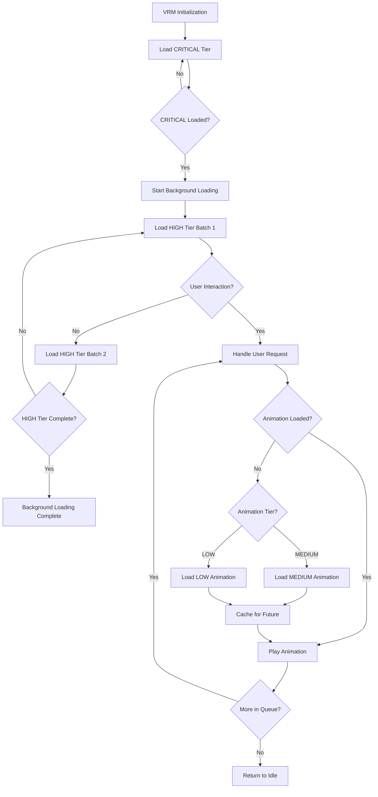
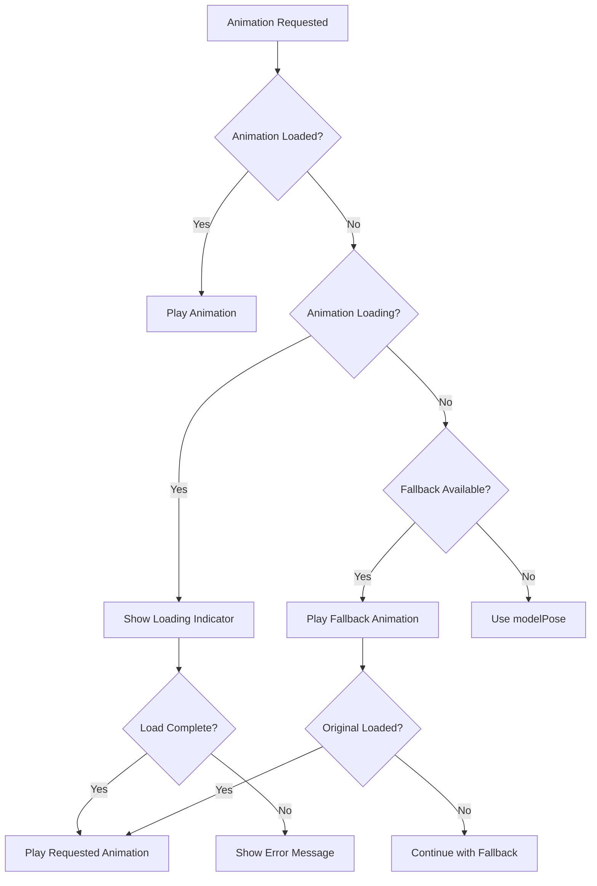

# VRMA Animation Lazy Loading Strategy

## Overview

This document outlines a comprehensive lazy loading strategy for VRMA animations in the 3D chat application. The goal is to reduce initial load time and memory usage while maintaining responsive animation playback by loading animations based on usage patterns and demand.

### Current State

- **Total Available Animations**: 209 (6 core + 142 extended + 20 gesture + 40 breakdance)
- **Currently Eager Loaded**: 38 animations during initialization
- **Existing Infrastructure**: Caching maps (`loadedAnimations`, `loadingPromises`, `retargetedClipCache`) and on-demand loading support

### Design Goals

1. Reduce initial load time by loading fewer animations upfront
2. Maintain responsive animation playback with minimal perceived delay
3. Leverage existing caching infrastructure
4. Provide graceful fallbacks for unloaded animations
5. Support predictive preloading based on usage patterns

---

## 1. Animation Priority Tiers

### Tier 1: CRITICAL (Immediate Load)

**Definition**: Animations required for basic avatar functionality and most common interactions.

**Load Timing**: During VRM initialization, before user interaction.

**Animations (6)**:
```typescript
const CRITICAL_ANIMATIONS = [
  'modelPose',    // Default idle state - always needed
  'greeting',     // Used while speaking - high frequency
  'peace',        // Happy emotion - high frequency
  'headNod',      // Agreement gestures - high frequency
  'shakingHeadNo', // Disagreement gestures - high frequency
  'acknowledging', // Conversation acknowledgment - high frequency
];
```

**Rationale**: These animations are used in every conversation session and form the foundation of avatar expressiveness.

---

### Tier 2: HIGH (Background Load)

**Definition**: Frequently used animations for common emotions and actions.

**Load Timing**: After CRITICAL tier completes, load in background batches with low priority.

**Animations (25)**:
```typescript
const HIGH_PRIORITY_ANIMATIONS = [
  // Core emotional expressions
  'happyIdle', 'sadIdle', 'thinking', 'angryGesture',
  'beingCocky', 'relievedSigh', 'disappointed', 'bashful',

  // Common social gestures
  'waving', 'bowing', 'salute', 'shakingHands1',
  'pointing', 'shrugging', 'thumbsUp', 'thumbsDown',

  // Common movements
  'idle', 'weightShift', 'walking', 'jumping',
  'sitting', 'standingUp', 'sittingDown',

  // Common actions
  'punch', 'catch', 'throwing', 'typing',
];
```

**Rationale**: These animations cover most emotional states and common user requests. Loading them in background ensures they're available when needed.

---

### Tier 3: MEDIUM (On-Demand Load)

**Definition**: Specialized animations for specific contexts (sports, music, stealth, etc.).

**Load Timing**: Load when first requested, cache for future use.

**Animations (80)**:
```typescript
const MEDIUM_PRIORITY_ANIMATIONS = [
  // Music & Performance (8)
  'guitarPlaying', 'pianoPlaying', 'playingDrums', 'playingTheViolin',
  'singing', 'singing_1', 'hipHopDance', 'hipHopDancing',

  // Dance variations (10)
  'swinging', 'catwalk', 'catwalkWalking', 'rumbaDancing',
  'sambaDancing', 'sillyDancing', 'twistDance', 'dancingTwerk',

  // Combat & Martial Arts (12)
  'dropKick', 'flyingKnee', 'daggerStab', 'bodyBlock',
  'centerBlock', 'reloading', 'magicCast', 'aimingGun',
  'takeCover', 'ninjaIdle', 'kipUp', 'roar',

  // Movement variations (15)
  'jogBackwards', 'climbing', 'turnLeft', 'turnRight',
  'runningUpStairs', 'startWalking', 'crouchToStand', 'sitToStand',
  'standToSit', 'jumpingDown', 'jumpingJacks', 'vaultOverBox',
  'skateboarding', 'swimming', 'paddling',

  // Sports (8)
  'golfBadShot', 'golfPrePutt', 'golfDrive', 'golfPuttVictory',
  'situps', 'plank', 'cartwheel', 'backflip',

  // Stealth (6)
  'lowCrawl', 'sneakingForward', 'sneakyWalking', 'lookOverShoulder',
  'nervouslyLookAround', 'plotting',

  // Other common actions (21)
  'talkingOnPhone', 'lookAround', 'textingAndWalking', 'pacingAndTalkingOnAPhone',
  'fishingCast', 'rummaging', 'searchingPockets', 'buttonPushing',
  'openDoor', 'startClimbingLadder', 'militarySignaling', 'patting',
  'petting', 'pettingAnimal', 'kiss', 'blowAKiss', 'praying',
  'yawn', 'smoking', 'lyingDown', 'layingIdle', 'kneeling',
];
```

**Rationale**: These animations are context-specific and may not be used in every session. Loading on-demand reduces initial load while caching ensures quick subsequent access.

---

### Tier 4: LOW (On-Demand Load)

**Definition**: Rarely used or highly specialized animations.

**Load Timing**: Load only when explicitly requested, with lower cache priority.

**Animations (98)**:
```typescript
const LOW_PRIORITY_ANIMATIONS = [
  // All breakdance animations (40)
  'breakdance1990', 'breakdance1990_2', 'breakdance1990_2_alt', 'breakdance1990_3',
  'breakdanceEnding1', 'breakdanceEnding2', 'breakdanceEnding3',
  'breakdanceFootwork1', 'breakdanceFootwork2', 'breakdanceFootwork3', 'breakdanceFootworkToFreeze',
  'breakdanceFreezes', 'breakdanceFreezeVar1', 'breakdanceFreezeVar2', 'breakdanceFreezeVar3', 'breakdanceFreezeVar4',
  'breakdanceReady', 'breakdanceReady_2', 'breakdanceReady_3',
  'breakdanceSwipes', 'breakdanceUprock', 'breakdanceUprock_2', 'breakdanceUprockToGround', 'breakdanceUprockToGround_2',
  'breakdanceUprockVar1', 'breakdanceUprockVar1End', 'breakdanceUprockVar1Start', 'breakdanceUprockVar2',
  'brooklynUprock', 'crosslegFreeze', 'flair', 'flair_2', 'flair_3',

  // Gesture variations (12)
  'hardHeadNod', 'lengthyHeadNod', 'sarcasticHeadNod', 'annoyedHeadShake',
  'thoughtfulHeadShake', 'happyHandGesture', 'dismissingGesture', 'lookAwayGesture',
  'cockyHeadTurn', 'strongGesture', 'standingClap', 'sittingClap',

  // Social variations (12)
  'standingGreeting', 'standingArguing', 'sittingTalking', 'sittingDisapproval',
  'beckoning', 'standingJump', 'sadWalk', 'defeatIdle',
  'victoryIdle', 'victory', 'yelling', 'standingClap',

  // Rare movements (12)
  'standardRun', 'floating', 'gettingUp', 'zombieStandUp',
  'catwalkTwistLToWalk180', 'catwalkWalkStopTwistR', 'entry', 'push',
  'pushStart', 'snatch', 'throwing',

  // Rare actions (22)
  'angryGesture_1', 'aimingGun', 'victory', 'situps', 'plank',
  'golfDrive', 'golfPuttVictory', 'jumpingJacks', 'vaultOverBox',
  'skateboarding', 'swimming', 'paddling', 'lowCrawl', 'sneakingForward',
  'sneakyWalking', 'lookOverShoulder', 'nervouslyLookAround', 'plotting',
  'militarySignaling', 'rummaging', 'searchingPockets', 'buttonPushing',

  // Rare idle states (5)
  'boredmelancholyIdle_1', 'ninjaIdle', 'defeatIdle', 'victoryIdle',
  'layingIdle',

  // Other rare animations (remaining)
  'sexyauton2.temp2169616280', // Temp file - consider removing
];
```

**Rationale**: These animations are rarely triggered by the LLM judge and can be loaded on-demand. Breakdance animations are grouped together as they're typically used in sequences.

---

## 2. Loading Strategy

### Loading Flow Diagram



### Loading Phases

#### Phase 1: Immediate Load (CRITICAL)

```typescript
async function loadCriticalAnimations(): Promise<void> {
  const criticalAnimations = CRITICAL_ANIMATIONS;
  console.log(`Loading ${criticalAnimations.length} CRITICAL animations...`);

  await Promise.allSettled(
    criticalAnimations.map(name => loadVRMAAnimation(name))
  );

  console.log('CRITICAL animations loaded. Avatar ready for interaction.');
}
```

**Characteristics**:
- Blocks VRM initialization until complete
- Parallel loading for speed
- ~6 animations × ~500ms each = ~3 seconds

#### Phase 2: Background Load (HIGH)

```typescript
async function loadHighPriorityAnimations(): Promise<void> {
  const batchSize = 5; // Load 5 at a time
  const batches = chunk(HIGH_PRIORITY_ANIMATIONS, batchSize);

  for (const batch of batches) {
    // Check if user is interacting - pause if needed
    if (!isUserInteracting()) {
      await Promise.allSettled(
        batch.map(name => loadVRMAAnimation(name))
      );
      await delay(100); // Small delay between batches
    }
  }
}
```

**Characteristics**:
- Non-blocking, runs in background
- Batched to avoid overwhelming the system
- Pauses during user interaction
- ~25 animations × ~500ms each = ~12.5 seconds (spread over time)

#### Phase 3: On-Demand Load (MEDIUM & LOW)

```typescript
async function loadAnimationOnDemand(animationName: string): Promise<void> {
  // Check if already loaded
  if (isAnimationLoaded(animationName)) {
    return;
  }

  // Check if already loading
  if (isLoading(animationName)) {
    return await waitForLoad(animationName);
  }

  // Load the animation
  try {
    await loadVRMAAnimation(animationName);
    trackUsage(animationName); // For predictive preloading
  } catch (error) {
    handleLoadError(animationName, error);
  }
}
```

**Characteristics**:
- Triggered by animation requests
- Deduplicates concurrent requests
- Tracks usage for predictive preloading

---

## 3. Fallback System

### Fallback Hierarchy

When an animation is requested but not yet loaded, use this fallback strategy:



### Fallback Animation Mapping

```typescript
const FALLBACK_MAP: Record<string, string> = {
  // Idle fallbacks
  'happyIdle': 'modelPose',
  'sadIdle': 'modelPose',
  'defeatIdle': 'modelPose',
  'victoryIdle': 'modelPose',

  // Gesture fallbacks
  'headNod': 'acknowledging',
  'hardHeadNod': 'headNod',
  'lengthyHeadNod': 'headNod',
  'sarcasticHeadNod': 'headNod',
  'shakingHeadNo': 'acknowledging',
  'annoyedHeadShake': 'shakingHeadNo',
  'thoughtfulHeadShake': 'shakingHeadNo',

  // Dance fallbacks
  'hipHopDance': 'greeting',
  'hipHopDancing': 'greeting',
  'swinging': 'greeting',
  'catwalk': 'greeting',
  'rumbaDancing': 'greeting',
  'sambaDancing': 'greeting',
  'sillyDancing': 'greeting',
  'twistDance': 'greeting',
  'dancingTwerk': 'greeting',

  // Combat fallbacks
  'punch': 'angryGesture',
  'dropKick': 'angryGesture',
  'flyingKnee': 'angryGesture',
  'daggerStab': 'angryGesture',
  'bodyBlock': 'angryGesture',
  'centerBlock': 'angryGesture',

  // Movement fallbacks
  'walking': 'modelPose',
  'jogBackwards': 'modelPose',
  'jumping': 'modelPose',
  'climbing': 'modelPose',

  // Default fallback
  'default': 'modelPose',
};
```

### Fallback Implementation

```typescript
function getFallbackAnimation(animationName: string): string {
  return FALLBACK_MAP[animationName] || FALLBACK_MAP['default'];
}

async function playAnimationWithFallback(animationName: string): Promise<void> {
  if (isAnimationLoaded(animationName)) {
    return playAnimation(animationName);
  }

  const fallback = getFallbackAnimation(animationName);

  if (isAnimationLoaded(fallback)) {
    // Play fallback while loading requested animation
    playAnimation(fallback);
    await loadAnimationOnDemand(animationName);
    return playAnimation(animationName);
  } else {
    // Use modelPose as ultimate fallback
    playAnimation('modelPose');
    await loadAnimationOnDemand(animationName);
    return playAnimation(animationName);
  }
}
```

---

## 4. Loading States & UI Indicators

### Loading State Types

```typescript
type LoadingState = 'idle' | 'loading' | 'loaded' | 'error';

interface AnimationLoadingState {
  name: string;
  state: LoadingState;
  progress?: number; // 0-100
  error?: string;
}
```

### UI Indicators

#### 1. Global Loading Progress

Show during initial CRITICAL tier load:

```typescript
// Component: AnimationLoadingIndicator
interface AnimationLoadingIndicatorProps {
  progress: number; // 0-100
  stage: 'critical' | 'background' | 'on-demand';
  message: string;
}
```

**Display**:
- Progress bar overlay during VRM initialization
- Message: "Loading animations... 3/6"
- Disappears when CRITICAL tier complete

#### 2. Per-Animation Loading Indicator

Show when on-demand animation is loading:

```typescript
// Component: AnimationLoadingToast
interface AnimationLoadingToastProps {
  animationName: string;
  fallbackPlaying: boolean;
}
```

**Display**:
- Small toast notification: "Loading 'backflip' animation..."
- Shows fallback animation name if playing
- Auto-dismisses after 2 seconds

#### 3. Background Loading Status

Optional debug/dev indicator:

```typescript
// Component: BackgroundLoadingStatus
interface BackgroundLoadingStatusProps {
  loaded: number;
  total: number;
  currentBatch: number;
}
```

**Display**:
- Small badge in corner
- Shows: "Background: 15/25 loaded"
- Only visible in dev mode

### State Management

```typescript
// Extend chatStore with loading states
interface AnimationLoadingStore {
  loadingStates: Map<string, AnimationLoadingState>;
  globalProgress: number;
  setLoadingState: (name: string, state: LoadingState) => void;
  getLoadingState: (name: string) => AnimationLoadingState | undefined;
}

export const useAnimationLoadingStore = create<AnimationLoadingStore>()((set) => ({
  loadingStates: new Map(),
  globalProgress: 0,

  setLoadingState: (name, state) => set((store) => {
    const newStates = new Map(store.loadingStates);
    newStates.set(name, { name, state });
    return { loadingStates: newStates };
  }),

  getLoadingState: (name) => {
    return store.loadingStates.get(name);
  },
}));
```

---

## 5. Error Handling

### Error Types

```typescript
type AnimationErrorType =
  | 'network_error'
  | 'file_not_found'
  | 'parse_error'
  | 'retargeting_error'
  | 'timeout';

interface AnimationError {
  type: AnimationErrorType;
  animationName: string;
  message: string;
  timestamp: number;
  retryCount: number;
}
```

### Error Handling Strategy

#### 1. Immediate Error Handling

```typescript
async function loadAnimationWithErrorHandling(
  animationName: string,
  retryCount = 0
): Promise<void> {
  try {
    await loadVRMAAnimation(animationName);
  } catch (error) {
    const errorType = classifyError(error);

    // Log error for debugging
    console.error(`Animation load failed: ${animationName}`, error);

    // Record error
    recordAnimationError({
      type: errorType,
      animationName,
      message: error.message,
      timestamp: Date.now(),
      retryCount,
    });

    // Retry for transient errors
    if (shouldRetry(errorType, retryCount)) {
      console.log(`Retrying ${animationName} (${retryCount + 1}/3)`);
      await delay(1000 * (retryCount + 1)); // Exponential backoff
      return loadAnimationWithErrorHandling(animationName, retryCount + 1);
    }

    // Use fallback for permanent errors
    const fallback = getFallbackAnimation(animationName);
    playAnimation(fallback);
    showUserError(animationName, errorType);
  }
}

function shouldRetry(errorType: AnimationErrorType, retryCount: number): boolean {
  const RETRYABLE_ERRORS = ['network_error', 'timeout'];
  const MAX_RETRIES = 3;

  return RETRYABLE_ERRORS.includes(errorType) && retryCount < MAX_RETRIES;
}
```

#### 2. User Error Notification

```typescript
function showUserError(animationName: string, errorType: AnimationErrorType): void {
  const messages: Record<AnimationErrorType, string> = {
    network_error: `Could not load '${animationName}'. Check your connection.`,
    file_not_found: `Animation '${animationName}' is not available.`,
    parse_error: `Animation '${animationName}' is corrupted.`,
    retargeting_error: `Animation '${animationName}' is not compatible with this model.`,
    timeout: `Loading '${animationName}' took too long.`,
  };

  const message = messages[errorType] || `Failed to load '${animationName}'.`;

  // Show non-intrusive toast
  showToast({
    message,
    type: 'warning',
    duration: 3000,
  });
}
```

#### 3. Error Recovery

```typescript
function handleAnimationError(error: AnimationError): void {
  switch (error.type) {
    case 'network_error':
      // Queue for retry when connection restored
      queueForRetry(error.animationName);
      break;

    case 'file_not_found':
      // Mark as permanently unavailable
      markUnavailable(error.animationName);
      break;

    case 'retargeting_error':
      // Mark as incompatible with current model
      markModelIncompatibility(error.animationName, currentModelId);
      break;

    default:
      // Log for investigation
      logErrorForInvestigation(error);
  }
}
```

### Error Tracking

```typescript
interface ErrorTracker {
  errors: AnimationError[];
  errorCounts: Map<string, number>;
  unavailableAnimations: Set<string>;
}

export const errorTracker: ErrorTracker = {
  errors: [],
  errorCounts: new Map(),
  unavailableAnimations: new Set(),
};

function recordAnimationError(error: AnimationError): void {
  errorTracker.errors.push(error);
  errorTracker.errorCounts.set(
    error.animationName,
    (errorTracker.errorCounts.get(error.animationName) || 0) + 1
  );

  // Mark as unavailable after 3 failures
  if (errorTracker.errorCounts.get(error.animationName)! >= 3) {
    errorTracker.unavailableAnimations.add(error.animationName);
  }
}

function isAnimationUnavailable(animationName: string): boolean {
  return errorTracker.unavailableAnimations.has(animationName);
}
```

---

## 6. Predictive Preloading

### Usage Tracking

Track animation usage patterns to predict likely future needs:

```typescript
interface UsageTracker {
  usageCount: Map<string, number>;
  lastUsed: Map<string, number>;
  sessionHistory: string[]; // Sequence of animations used
}

export const usageTracker: UsageTracker = {
  usageCount: new Map(),
  lastUsed: new Map(),
  sessionHistory: [],
};

function trackAnimationUsage(animationName: string): void {
  // Update count
  usageTracker.usageCount.set(
    animationName,
    (usageTracker.usageCount.get(animationName) || 0) + 1
  );

  // Update last used
  usageTracker.lastUsed.set(animationName, Date.now());

  // Add to history (keep last 50)
  usageTracker.sessionHistory.push(animationName);
  if (usageTracker.sessionHistory.length > 50) {
    usageTracker.sessionHistory.shift();
  }
}
```

### Prediction Strategies

#### Strategy 1: Sequential Prediction

Preload animations that commonly follow the current one:

```typescript
function predictNextAnimations(currentAnimation: string): string[] {
  const history = usageTracker.sessionHistory;
  const predictions: string[] = [];

  // Find patterns in history
  for (let i = 0; i < history.length - 1; i++) {
    if (history[i] === currentAnimation) {
      const next = history[i + 1];
      if (!predictions.includes(next)) {
        predictions.push(next);
      }
    }
  }

  // Return top 3 predictions
  return predictions.slice(0, 3);
}

function preloadPredictions(currentAnimation: string): void {
  const predictions = predictNextAnimations(currentAnimation);

  predictions.forEach(async (animationName) => {
    if (!isAnimationLoaded(animationName) && !isLoading(animationName)) {
      // Preload with low priority
      loadAnimationWithPriority(animationName, 'low');
    }
  });
}
```

#### Strategy 2: Category Prediction

Preload animations from the same category:

```typescript
function getAnimationCategory(animationName: string): string {
  const categoryMap: Record<string, string> = {
    'greeting': 'social',
    'peace': 'gesture',
    'spin': 'dance',
    'punch': 'combat',
    // ... etc
  };

  return categoryMap[animationName] || 'misc';
}

function preloadCategory(animationName: string): void {
  const category = getAnimationCategory(animationName);
  const sameCategoryAnimations = getAnimationsByCategory(category);

  // Preload 2 more from same category
  sameCategoryAnimations
    .filter(a => a !== animationName)
    .slice(0, 2)
    .forEach(async (anim) => {
      if (!isAnimationLoaded(anim) && !isLoading(anim)) {
        loadAnimationWithPriority(anim, 'low');
      }
    });
}
```

#### Strategy 3: LLM-Guided Prediction

Use the LLM's judgment to preload related animations:

```typescript
async function preloadFromLLMJudgment(judgment: AnimationJudgment): Promise<void> {
  const requestedAnimations = judgment.animations.map(a => a.name);

  // Preload animations that are semantically related
  const related = await getRelatedAnimations(requestedAnimations);

  related.forEach(async (anim) => {
    if (!isAnimationLoaded(anim) && !isLoading(anim)) {
      loadAnimationWithPriority(anim, 'low');
    }
  });
}

async function getRelatedAnimations(animations: string[]): Promise<string[]> {
  // Call LLM with current animations
  // Ask: "What other animations might be used in this context?"
  // Return top 5 suggestions
  // Implementation depends on LLM availability
}
```

### Priority-Based Loading

```typescript
type LoadPriority = 'critical' | 'high' | 'normal' | 'low';

async function loadAnimationWithPriority(
  animationName: string,
  priority: LoadPriority
): Promise<void> {
  const priorityQueue = getPriorityQueue(priority);

  // Add to appropriate queue
  priorityQueue.push(animationName);

  // Process queue based on priority
  if (priority === 'critical' || priority === 'high') {
    processQueueImmediately(priorityQueue);
  } else {
    processQueueInBackground(priorityQueue);
  }
}
```

---

## 7. Performance Considerations

### Memory Management

```typescript
// Cache size limits
const MAX_LOADED_ANIMATIONS = 50;
const MAX_RETARGETED_CLIPS_PER_MODEL = 30;

function manageCacheSize(): void {
  const loadedCount = vrmaAnimationService.getLoadedCount();

  if (loadedCount > MAX_LOADED_ANIMATIONS) {
    // Evict least recently used animations
    const lruAnimations = getLeastRecentlyUsedAnimations(
      loadedCount - MAX_LOADED_ANIMATIONS
    );

    lruAnimations.forEach(anim => {
      vrmaAnimationService.unloadAnimation(anim);
    });
  }
}

function getLeastRecentlyUsedAnimations(count: number): string[] {
  // Sort by lastUsed timestamp
  const sorted = Array.from(usageTracker.lastUsed.entries())
    .sort((a, b) => a[1] - b[1]);

  return sorted.slice(0, count).map(([name]) => name);
}
```

### Loading Optimization

```typescript
// Batch loading to avoid overwhelming the browser
const CONCURRENT_LOAD_LIMIT = 3;
const LOAD_BATCH_SIZE = 5;

async function loadAnimationsOptimized(animationNames: string[]): Promise<void> {
  const batches = chunk(animationNames, LOAD_BATCH_SIZE);

  for (const batch of batches) {
    // Limit concurrent loads
    await Promise.allSettled(
      batch.slice(0, CONCURRENT_LOAD_LIMIT).map(loadVRMAAnimation)
    );

    // Small delay between batches
    await delay(50);

    // Continue with remaining in batch
    if (batch.length > CONCURRENT_LOAD_LIMIT) {
      await loadAnimationsOptimized(batch.slice(CONCURRENT_LOAD_LIMIT));
    }
  }
}
```

### Performance Metrics

```typescript
interface AnimationLoadMetrics {
  loadTime: number;
  retargetTime: number;
  totalTime: number;
  fileSize: number;
}

function trackLoadMetrics(animationName: string, metrics: AnimationLoadMetrics): void {
  // Store metrics for analysis
  const metricsStore = getMetricsStore();
  metricsStore.recordAnimationLoad(animationName, metrics);

  // Log slow loads
  if (metrics.totalTime > 2000) {
    console.warn(`Slow animation load: ${animationName} (${metrics.totalTime}ms)`);
  }
}
```

---

## 8. Implementation Checklist

### Phase 1: Core Infrastructure

- [ ] Define animation priority tiers in `vrmaAnimationService.ts`
- [ ] Add `loadTier()` method for tier-based loading
- [ ] Implement fallback animation mapping
- [ ] Add error classification and handling

### Phase 2: State Management

- [ ] Create `useAnimationLoadingStore` for loading states
- [ ] Add loading progress tracking
- [ ] Implement error tracking store

### Phase 3: UI Components

- [ ] Create `AnimationLoadingIndicator` for initial load
- [ ] Create `AnimationLoadingToast` for on-demand loads
- [ ] Add optional `BackgroundLoadingStatus` for dev mode

### Phase 4: Integration

- [ ] Update `AvatarModel.tsx` to use tier-based loading
- [ ] Replace eager loading with CRITICAL tier only
- [ ] Add background loading for HIGH tier
- [ ] Implement on-demand loading with fallbacks

### Phase 5: Optimization

- [ ] Add usage tracking
- [ ] Implement sequential prediction
- [ ] Add cache size management
- [ ] Optimize batch loading

---

## 9. Migration Path

### Step 1: Add New Infrastructure (No Breaking Changes)

```typescript
// Add new methods to vrmaAnimationService
class VRMAAnimationService {
  // Existing methods...

  // New methods
  async loadCriticalAnimations(): Promise<void>
  async loadHighPriorityAnimations(): Promise<void>
  async loadAnimationWithFallback(name: string): Promise<void>
  getFallbackAnimation(name: string): string
}
```

### Step 2: Update AvatarModel Loading

```typescript
// Before: Eager load 38 animations
const allAnimations = [...coreAnimations, ...extendedAnimations];
Promise.allSettled(allAnimations.map(name => loadVRMAAnimation(name)));

// After: Load CRITICAL tier only
await vrmaAnimationService.loadCriticalAnimations();

// Start background loading
vrmaAnimationService.loadHighPriorityAnimations();
```

### Step 3: Add On-Demand Loading

```typescript
// Update fadeToAction to handle unloaded animations
async function fadeToAction(actionName: string, duration: number = 0.3) {
  let action = vrmaActions.current[actionName];

  if (!action) {
    // Load on-demand with fallback
    action = await vrmaAnimationService.loadAnimationWithFallback(actionName);
  }

  // ... rest of existing logic
}
```

### Step 4: Gradual Rollout

1. **Week 1**: Deploy with CRITICAL tier only
2. **Week 2**: Add HIGH tier background loading
3. **Week 3**: Enable on-demand loading with fallbacks
4. **Week 4**: Add predictive preloading

---

## 10. Success Metrics

### Performance Metrics

- **Initial Load Time**: Target < 3 seconds (currently ~8 seconds)
- **First Animation Delay**: Target < 500ms for CRITICAL tier
- **Memory Usage**: Target < 100MB for animations (currently ~200MB)
- **Cache Hit Rate**: Target > 80% (animations loaded before use)

### User Experience Metrics

- **Fallback Rate**: Target < 5% (animations that need fallback)
- **Error Rate**: Target < 1% (failed animation loads)
- **User Perceived Latency**: Target < 200ms (time from request to play)

---

## Appendix A: Complete Animation Tier List

### CRITICAL Tier (6 animations)
- modelPose
- greeting
- peace
- headNod
- shakingHeadNo
- acknowledging

### HIGH Tier (25 animations)
- happyIdle, sadIdle, thinking, angryGesture
- beingCocky, relievedSigh, disappointed, bashful
- waving, bowing, salute, shakingHands1
- pointing, shrugging, thumbsUp, thumbsDown
- idle, weightShift, walking, jumping
- sitting, standingUp, sittingDown
- punch, catch, throwing, typing

### MEDIUM Tier (80 animations)
- Music & Performance: guitarPlaying, pianoPlaying, playingDrums, playingTheViolin, singing, singing_1, hipHopDance, hipHopDancing
- Dance: swinging, catwalk, catwalkWalking, rumbaDancing, sambaDancing, sillyDancing, twistDance, dancingTwerk
- Combat: dropKick, flyingKnee, daggerStab, bodyBlock, centerBlock, reloading, magicCast, aimingGun, takeCover, ninjaIdle, kipUp, roar
- Movement: jogBackwards, climbing, turnLeft, turnRight, runningUpStairs, startWalking, crouchToStand, sitToStand, standToSit, jumpingDown, jumpingJacks, vaultOverBox, skateboarding, swimming, paddling
- Sports: golfBadShot, golfPrePutt, golfDrive, golfPuttVictory, situps, plank, cartwheel, backflip
- Stealth: lowCrawl, sneakingForward, sneakyWalking, lookOverShoulder, nervouslyLookAround, plotting
- Other: talkingOnPhone, lookAround, textingAndWalking, pacingAndTalkingOnAPhone, fishingCast, rummaging, searchingPockets, buttonPushing, openDoor, startClimbingLadder, militarySignaling, patting, petting, pettingAnimal, kiss, blowAKiss, praying, yawn, smoking, lyingDown, layingIdle, kneeling

### LOW Tier (98 animations)
- Breakdance (40): breakdance1990, breakdance1990_2, breakdance1990_2_alt, breakdance1990_3, breakdanceEnding1, breakdanceEnding2, breakdanceEnding3, breakdanceFootwork1, breakdanceFootwork2, breakdanceFootwork3, breakdanceFootworkToFreeze, breakdanceFreezes, breakdanceFreezeVar1, breakdanceFreezeVar2, breakdanceFreezeVar3, breakdanceFreezeVar4, breakdanceReady, breakdanceReady_2, breakdanceReady_3, breakdanceSwipes, breakdanceUprock, breakdanceUprock_2, breakdanceUprockToGround, breakdanceUprockToGround_2, breakdanceUprockVar1, breakdanceUprockVar1End, breakdanceUprockVar1Start, breakdanceUprockVar2, brooklynUprock, crosslegFreeze, flair, flair_2, flair_3
- Gesture Variations (12): hardHeadNod, lengthyHeadNod, sarcasticHeadNod, annoyedHeadShake, thoughtfulHeadShake, happyHandGesture, dismissingGesture, lookAwayGesture, cockyHeadTurn, strongGesture, standingClap, sittingClap
- Social Variations (12): standingGreeting, standingArguing, sittingTalking, sittingDisapproval, beckoning, standingJump, sadWalk, defeatIdle, victoryIdle, victory, yelling, standingClap
- Rare Movements (12): standardRun, floating, gettingUp, zombieStandUp, catwalkTwistLToWalk180, catwalkWalkStopTwistR, entry, push, pushStart, snatch, throwing
- Rare Actions (22): angryGesture_1, aimingGun, victory, situps, plank, golfDrive, golfPuttVictory, jumpingJacks, vaultOverBox, skateboarding, swimming, paddling, lowCrawl, sneakingForward, sneakyWalking, lookOverShoulder, nervouslyLookAround, plotting, militarySignaling, rummaging, searchingPockets, buttonPushing
- Rare Idle States (5): boredmelancholyIdle_1, ninjaIdle, defeatIdle, victoryIdle, layingIdle
- Other: sexyauton2.temp2169616280 (consider removing)

---

## Appendix B: Pseudocode Reference

### Main Loading Function

```typescript
async function initializeAnimationLoading(): Promise<void> {
  // Phase 1: Load CRITICAL animations (blocking)
  await loadCriticalAnimations();

  // Phase 2: Start background loading (non-blocking)
  loadHighPriorityAnimationsInBackground();

  // Phase 3: Setup on-demand loading
  setupOnDemandLoading();

  // Phase 4: Enable predictive preloading
  enablePredictivePreloading();
}
```

### On-Demand Loading with Fallback

```typescript
async function playAnimationWithFallback(animationName: string): Promise<void> {
  // Check if already loaded
  if (isAnimationLoaded(animationName)) {
    return playAnimation(animationName);
  }

  // Check if currently loading
  if (isLoading(animationName)) {
    // Wait for load to complete
    await waitForLoad(animationName);
    return playAnimation(animationName);
  }

  // Get fallback animation
  const fallback = getFallbackAnimation(animationName);

  // Play fallback if available
  if (isAnimationLoaded(fallback)) {
    playAnimation(fallback);
    showLoadingToast(animationName, fallback);
  }

  // Load requested animation
  try {
    await loadAnimation(animationName);
    playAnimation(animationName);
  } catch (error) {
    // Continue with fallback
    console.error(`Failed to load ${animationName}, using ${fallback}`);
    handleLoadError(animationName, error);
  }
}
```

### Background Loading

```typescript
async function loadHighPriorityAnimationsInBackground(): Promise<void> {
  const animations = HIGH_PRIORITY_ANIMATIONS;
  const batchSize = 5;

  for (let i = 0; i < animations.length; i += batchSize) {
    const batch = animations.slice(i, i + batchSize);

    // Pause if user is interacting
    if (isUserInteracting()) {
      await waitForIdle();
    }

    // Load batch
    await Promise.allSettled(
      batch.map(loadAnimation)
    );

    // Update progress
    updateBackgroundProgress(i + batchSize, animations.length);

    // Small delay between batches
    await delay(100);
  }
}
```

---

## Conclusion

This lazy loading strategy provides a balanced approach to animation management:

1. **Immediate Availability**: CRITICAL tier ensures core functionality works instantly
2. **Progressive Enhancement**: Background loading adds more animations over time
3. **Responsive Experience**: On-demand loading with fallbacks prevents visible delays
4. **Smart Optimization**: Predictive preloading anticipates user needs
5. **Graceful Degradation**: Fallback system handles all error scenarios

The strategy leverages existing infrastructure and can be implemented incrementally without breaking changes.
