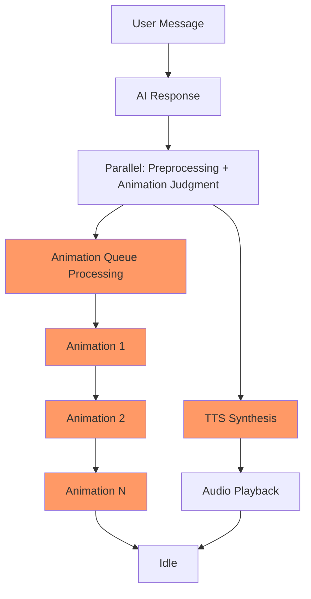
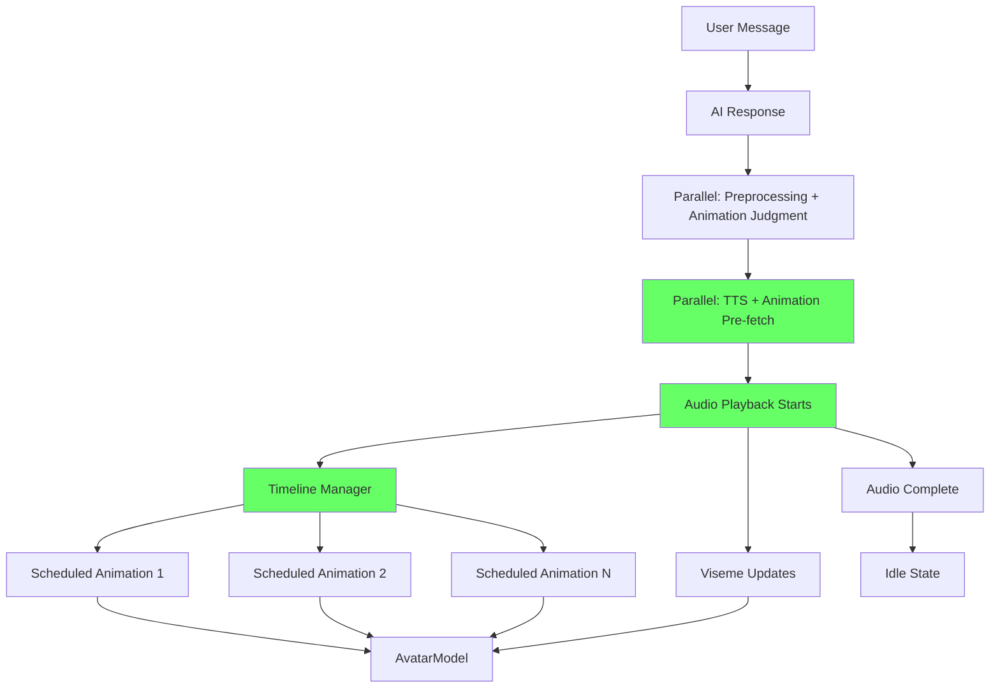
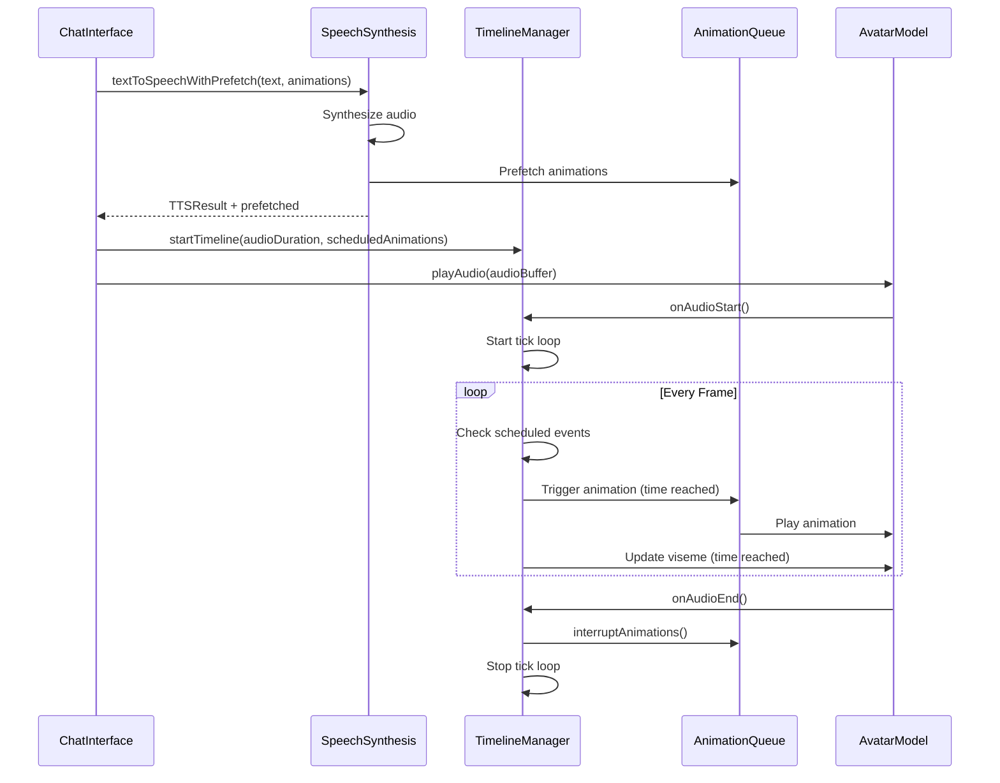

# Parallel Execution Strategy for Animation and Text Pipelines

## Executive Summary

This document outlines a comprehensive architecture redesign to enable parallel execution of animation and text-to-speech (TTS) pipelines in the 3D chat application. The new design addresses critical sequential bottlenecks by implementing audio-driven animation timing, parallel TTS + animation loading, and a unified synchronization mechanism.

**Current Bottlenecks:**
- Animation queue starts before audio playback (no coordination)
- Sequential animation queue processing
- On-demand animation loading delays animation triggers
- Estimated impact: 150-800ms per message

**Target Improvements:**
- Audio-driven animation scheduling (animations sync to audio timeline)
- Parallel TTS + animation pre-fetching
- Event-driven animation triggers
- Estimated savings: 200-600ms per message

---

## 1. Architecture Overview

### 1.1 Current Flow (Sequential)



**Problem:** Animation queue and audio playback are independent. Animations play based on fixed delays, not audio timing.

### 1.2 New Flow (Parallel, Audio-Driven)



**Key Changes:**
1. TTS and animation pre-fetch run in parallel
2. Audio playback starts immediately after TTS
3. Timeline manager coordinates animations to audio timestamps
4. Animations trigger based on audio events, not fixed delays

---

## 2. Audio-Driven Animation Timing

### 2.1 Core Concept

Instead of using fixed delays, animations are scheduled relative to audio playback time:

```typescript
interface ScheduledAnimation {
  name: string;
  triggerTime: number;  // Milliseconds from audio start
  duration: number;     // Animation duration in ms
  layer?: AnimationLayer;
  interruptible?: boolean;
}
```

### 2.2 Timeline Manager

A new service that coordinates all timing-sensitive events:

**File:** `src/services/timelineManager.ts`

```typescript
interface TimelineEvent {
  id: string;
  timestamp: number;  // Absolute timestamp or relative to audio start
  type: 'animation' | 'viseme' | 'emotion' | 'custom';
  data: unknown;
  callback: () => void;
}

class TimelineManager {
  private events: TimelineEvent[] = [];
  private audioStartTime: number = 0;
  private isPlaying: boolean = false;
  private animationFrameId: number | null = null;

  // Start timeline synchronized with audio
  start(audioDuration: number): void {
    this.audioStartTime = performance.now();
    this.isPlaying = true;
    this.tick();
  }

  // Schedule an event at a specific time
  schedule(event: TimelineEvent): void {
    this.events.push(event);
    this.events.sort((a, b) => a.timestamp - b.timestamp);
  }

  // Main tick loop
  private tick(): void {
    if (!this.isPlaying) return;

    const currentTime = performance.now() - this.audioStartTime;
    
    // Execute all events whose time has passed
    while (this.events.length > 0 && this.events[0].timestamp <= currentTime) {
      const event = this.events.shift()!;
      event.callback();
    }

    this.animationFrameId = requestAnimationFrame(() => this.tick());
  }

  stop(): void {
    this.isPlaying = false;
    if (this.animationFrameId) {
      cancelAnimationFrame(this.animationFrameId);
    }
  }

  clear(): void {
    this.events = [];
    this.stop();
  }
}
```

### 2.3 Animation Scheduling

Animations are distributed across the audio duration:

```typescript
function distributeAnimationsAcrossAudio(
  animations: AnimationTrigger[],
  audioDuration: number
): ScheduledAnimation[] {
  const scheduled: ScheduledAnimation[] = [];
  
  if (animations.length === 0) return scheduled;
  if (animations.length === 1) {
    // Single animation at 30% of audio
    return [{
      name: animations[0].name,
      triggerTime: audioDuration * 0.3,
      duration: getAnimationDuration(animations[0].name)
    }];
  }

  // Distribute evenly with some randomness for natural feel
  const segmentSize = audioDuration / (animations.length + 1);
  
  animations.forEach((anim, index) => {
    const baseTime = segmentSize * (index + 1);
    // Add slight randomness (+/- 10%)
    const randomOffset = (Math.random() - 0.5) * segmentSize * 0.2;
    const triggerTime = Math.max(0, Math.min(audioDuration, baseTime + randomOffset));
    
    scheduled.push({
      name: anim.name,
      triggerTime,
      duration: getAnimationDuration(anim.name)
    });
  });

  return scheduled;
}
```

### 2.4 Handling Audio Duration Mismatches

**Case 1: Audio shorter than expected**
- Remaining animations are cancelled
- Avatar transitions to idle smoothly

**Case 2: Audio longer than expected**
- Idle animation continues until audio ends
- Subtle idle variations can be scheduled

**Case 3: Audio playback interrupted**
- Timeline manager stops immediately
- Current animation fades out to idle
- All pending events are cleared

---

## 3. Parallel TTS + Animation Loading

### 3.1 Current State

TTS and animation loading are sequential:
```
TTS (200-500ms) → Animation Queue Setup → Animation Loading (100-300ms)
```

### 3.2 New Parallel Flow

```
Parallel Start:
├─ TTS Synthesis (200-500ms)
└─ Animation Pre-fetch (100-300ms)
     └─ Based on animation judgment results
```

### 3.3 Pre-fetch Strategy

**File:** `src/services/animationPrefetchService.ts`

```typescript
class AnimationPrefetchService {
  private prefetchQueue: Set<string> = new Set();
  private loadingPromises: Map<string, Promise<void>> = new Map();

  // Prefetch animations based on judgment
  async prefetchAnimations(animations: AnimationTrigger[]): Promise<void> {
    const uniqueNames = [...new Set(animations.map(a => a.name))];
    
    // Load in parallel batches
    const batchSize = 3;
    for (let i = 0; i < uniqueNames.length; i += batchSize) {
      const batch = uniqueNames.slice(i, i + batchSize);
      await Promise.allSettled(
        batch.map(name => this.prefetchSingle(name))
      );
    }
  }

  private async prefetchSingle(name: string): Promise<void> {
    // Skip if already loaded or loading
    if (vrmaAnimationService.isLoaded(name)) return;
    if (this.loadingPromises.has(name)) {
      return this.loadingPromises.get(name);
    }

    const promise = vrmaAnimationService.loadAnimationOnDemand(name)
      .catch(error => {
        console.warn(`Prefetch failed for ${name}:`, error);
        // Don't fail the whole batch
      });
    
    this.loadingPromises.set(name, promise);
    await promise;
    this.loadingPromises.delete(name);
  }
}
```

### 3.4 Integration with TTS

**File:** `src/services/speechSynthesisService.ts` (modified)

```typescript
export async function textToSpeechWithPrefetch(
  text: string,
  animations: AnimationTrigger[]
): Promise<TTSResult & { prefetchedAnimations: string[] }> {
  // Run TTS and animation prefetch in parallel
  const [ttsResult, prefetchResult] = await Promise.allSettled([
    textToSpeech(text),
    animationPrefetchService.prefetchAnimations(animations)
  ]);

  if (ttsResult.status === 'rejected') {
    throw ttsResult.reason;
  }

  const prefetched = prefetchResult.status === 'fulfilled'
    ? animations.map(a => a.name)
    : [];

  return {
    ...ttsResult.value,
    prefetchedAnimations: prefetched
  };
}
```

---

## 4. Animation Queue Redesign

### 4.1 Current Queue Issues

```typescript
// Current: Sequential processing with setTimeout chains
function processAnimationQueue(animations, onPlay, onComplete) {
  let currentIndex = 0;
  const playNext = () => {
    if (currentIndex >= animations.length) {
      onComplete();
      return;
    }
    // ... setTimeout chains
  };
  playNext();
}
```

**Problems:**
- Cannot interrupt animations
- No layering support
- Fixed delays don't account for audio timing

### 4.2 New Queue Design

**File:** `src/services/animationQueueService.ts`

```typescript
interface AnimationLayer {
  id: string;
  priority: number;  // Higher = more important
  currentAnimation: string | null;
  blendWeight: number;  // 0-1
}

interface QueuedAnimation {
  id: string;
  name: string;
  layer: AnimationLayerType;
  startTime: number;
  duration: number;
  blendIn: number;
  blendOut: number;
  interruptible: boolean;
}

type AnimationLayerType = 
  | 'full_body'      // High priority, overrides everything
  | 'upper_body'      // Can layer over lower body
  | 'lower_body'      // Can layer under upper body
  | 'gesture'         // Hand/head gestures, lowest priority
  | 'idle';           // Default state

class AnimationQueueService {
  private queue: QueuedAnimation[] = [];
  private activeLayers: Map<AnimationLayerType, QueuedAnimation> = new Map();
  private timelineManager: TimelineManager;
  private mixer: THREE.AnimationMixer;

  // Schedule animation on timeline
  scheduleAnimation(
    animation: QueuedAnimation,
    audioOffset: number
  ): void {
    const event: TimelineEvent = {
      id: animation.id,
      timestamp: animation.startTime + audioOffset,
      type: 'animation',
      data: animation,
      callback: () => this.playAnimation(animation)
    };
    
    this.timelineManager.schedule(event);
  }

  // Play animation with layering support
  private playAnimation(animation: QueuedAnimation): void {
    const layerType = animation.layer;
    
    // Fade out current animation on this layer
    const current = this.activeLayers.get(layerType);
    if (current) {
      this.fadeOutAnimation(current, animation.blendIn);
    }

    // Fade in new animation
    this.fadeInAnimation(animation, animation.blendIn);
    this.activeLayers.set(layerType, animation);

    // Schedule fade out
    if (animation.duration > 0) {
      const fadeOutEvent: TimelineEvent = {
        id: `${animation.id}_fadeOut`,
        timestamp: animation.startTime + animation.duration,
        type: 'animation',
        data: animation,
        callback: () => this.fadeOutAnimation(animation, animation.blendOut)
      };
      this.timelineManager.schedule(fadeOutEvent);
    }
  }

  // Interrupt current animations
  interrupt(exceptLayers: AnimationLayerType[] = []): void {
    this.activeLayers.forEach((anim, layer) => {
      if (!exceptLayers.includes(layer) && anim.interruptible) {
        this.fadeOutAnimation(anim, 0.2); // Quick fade out
        this.activeLayers.delete(layer);
      }
    });
  }

  private fadeInAnimation(animation: QueuedAnimation, duration: number): void {
    const action = this.getAction(animation.name);
    if (!action) return;
    
    action.reset();
    action.fadeIn(duration).play();
  }

  private fadeOutAnimation(animation: QueuedAnimation, duration: number): void {
    const action = this.getAction(animation.name);
    if (!action) return;
    
    action.fadeOut(duration);
  }

  private getAction(name: string): THREE.AnimationAction | null {
    // Get from AvatarModel's mixer
    return this.mixer.clipAction(/* clip */);
  }
}
```

### 4.3 Layer Priorities

```typescript
const LAYER_PRIORITIES: Record<AnimationLayerType, number> = {
  full_body: 100,
  upper_body: 75,
  lower_body: 50,
  gesture: 25,
  idle: 0
};
```

**Layer Behavior:**
- `full_body`: Overrides all other layers (e.g., dance, combat)
- `upper_body`: Can play over lower body (e.g., wave while walking)
- `lower_body`: Can play under upper body (e.g., walking while waving)
- `gesture`: Subtle movements, lowest priority
- `idle`: Default state, fades in when no other animations active

---

## 5. Synchronization Mechanism

### 5.1 Unified Timeline System

The TimelineManager becomes the central coordination point for all time-based events:

```typescript
interface TimelineCoordinator {
  // Audio events
  onAudioStart: (duration: number) => void;
  onAudioProgress: (currentTime: number) => void;
  onAudioEnd: () => void;
  
  // Animation events
  scheduleAnimation: (animation: ScheduledAnimation) => void;
  interruptAnimations: () => void;
  
  // Viseme events
  scheduleViseme: (viseme: VisemeData, time: number) => void;
  
  // Emotion events
  scheduleEmotion: (emotion: Emotion, time: number) => void;
}
```

### 5.2 Event-Driven Architecture



### 5.3 Audio Event Listeners

**File:** `src/services/speechSynthesisService.ts` (enhanced)

```typescript
export interface AudioPlaybackOptions {
  onProgress?: (currentTime: number, duration: number) => void;
  onEnded?: () => void;
  onInterrupted?: () => void;
}

export async function playAudioWithEvents(
  audioBuffer: ArrayBuffer,
  options: AudioPlaybackOptions = {}
): Promise<void> {
  if (!audioContext) {
    audioContext = new (window.AudioContext || window.webkitAudioContext)();
  }
  
  const decodedData = await audioContext.decodeAudioData(audioBuffer);
  const source = audioContext.createBufferSource();
  source.buffer = decodedData;
  
  // Track playback time
  const startTime = audioContext.currentTime;
  
  source.onended = () => {
    options.onEnded?.();
  };
  
  source.start(0);
  
  // Progress tracking (optional, for viseme sync)
  if (options.onProgress) {
    const progressInterval = setInterval(() => {
      const currentTime = audioContext.currentTime - startTime;
      options.onProgress(currentTime, decodedData.duration);
    }, 50); // 20fps updates
    
    source.onended = () => {
      clearInterval(progressInterval);
      options.onEnded?.();
    };
  }
  
  return new Promise((resolve, reject) => {
    source.onended = () => resolve();
    source.onerror = reject;
  });
}
```

---

## 6. State Management Changes

### 6.1 New Store: Timeline Store

**File:** `src/store/timelineStore.ts`

```typescript
interface TimelineState {
  // Timeline status
  isPlaying: boolean;
  startTime: number | null;
  currentTime: number;
  duration: number;
  
  // Scheduled events
  scheduledAnimations: ScheduledAnimation[];
  scheduledVisemes: Array<{ viseme: VisemeData; time: number }>;
  scheduledEmotions: Array<{ emotion: Emotion; time: number }>;
  
  // Active state
  activeAnimations: Map<AnimationLayerType, string>;
  currentViseme: VisemeName | null;
  currentEmotion: Emotion;
  
  // Actions
  startTimeline: (duration: number) => void;
  stopTimeline: () => void;
  scheduleAnimation: (animation: ScheduledAnimation) => void;
  scheduleViseme: (viseme: VisemeData, time: number) => void;
  scheduleEmotion: (emotion: Emotion, time: number) => void;
  updateCurrentTime: (time: number) => void;
  clearTimeline: () => void;
}

export const useTimelineStore = create<TimelineState>((set) => ({
  isPlaying: false,
  startTime: null,
  currentTime: 0,
  duration: 0,
  scheduledAnimations: [],
  scheduledVisemes: [],
  scheduledEmotions: [],
  activeAnimations: new Map(),
  currentViseme: null,
  currentEmotion: 'neutral',
  
  startTimeline: (duration) => set({
    isPlaying: true,
    startTime: performance.now(),
    duration,
    currentTime: 0
  }),
  
  stopTimeline: () => set({
    isPlaying: false,
    startTime: null,
    activeAnimations: new Map()
  }),
  
  scheduleAnimation: (animation) => set((state) => ({
    scheduledAnimations: [...state.scheduledAnimations, animation].sort(
      (a, b) => a.triggerTime - b.triggerTime
    )
  })),
  
  scheduleViseme: (viseme, time) => set((state) => ({
    scheduledVisemes: [...state.scheduledVisemes, { viseme, time }].sort(
      (a, b) => a.time - b.time
    )
  })),
  
  scheduleEmotion: (emotion, time) => set((state) => ({
    scheduledEmotions: [...state.scheduledEmotions, { emotion, time }].sort(
      (a, b) => a.time - b.time
    )
  })),
  
  updateCurrentTime: (time) => set({ currentTime: time }),
  
  clearTimeline: () => set({
    scheduledAnimations: [],
    scheduledVisemes: [],
    scheduledEmotions: [],
    activeAnimations: new Map(),
    currentViseme: null
  })
}));
```

### 6.2 Updated Chat Store

**File:** `src/store/chatStore.ts` (modified)

```typescript
export interface ChatState {
  // ... existing fields ...
  
  // New fields for parallel execution
  audioPlaybackState: 'idle' | 'playing' | 'paused' | 'stopped';
  audioProgress: number;  // Current playback position in ms
  audioDuration: number;  // Total audio duration in ms
  timelineSessionId: string | null;  // Unique ID for current timeline session
  
  // New actions
  setAudioPlaybackState: (state: 'idle' | 'playing' | 'paused' | 'stopped') => void;
  setAudioProgress: (progress: number) => void;
  setAudioDuration: (duration: number) => void;
  setTimelineSessionId: (id: string | null) => void;
}
```

### 6.3 Store Integration

```typescript
// In ChatInterface.tsx
const timelineStore = useTimelineStore();
const chatStore = useChatStore();

// When starting audio playback
const handleAudioStart = (duration: number) => {
  const sessionId = crypto.randomUUID();
  
  chatStore.setTimelineSessionId(sessionId);
  chatStore.setAudioDuration(duration);
  chatStore.setAudioPlaybackState('playing');
  
  timelineStore.startTimeline(duration);
  
  // Schedule animations based on audio duration
  const scheduled = distributeAnimationsAcrossAudio(
    animationJudgment.animations,
    duration
  );
  
  scheduled.forEach(anim => {
    timelineStore.scheduleAnimation(anim);
  });
  
  // Start timeline manager
  timelineManager.start(duration);
};

// When audio ends
const handleAudioEnd = () => {
  chatStore.setAudioPlaybackState('idle');
  chatStore.setTimelineSessionId(null);
  
  timelineStore.stopTimeline();
  timelineManager.stop();
};
```

---

## 7. API Design and Interfaces

### 7.1 New Service: TimelineManager

**Location:** `src/services/timelineManager.ts`

```typescript
export interface TimelineEvent {
  id: string;
  timestamp: number;
  type: 'animation' | 'viseme' | 'emotion' | 'custom';
  data: unknown;
  callback: () => void;
  priority?: number;  // For event ordering at same timestamp
}

export interface TimelineOptions {
  tickRate?: number;  // ms between ticks (default: ~16ms for 60fps)
  maxLookahead?: number;  // ms to look ahead for events
}

export class TimelineManager {
  constructor(options?: TimelineOptions);
  
  // Lifecycle
  start(audioDuration: number): void;
  stop(): void;
  pause(): void;
  resume(): void;
  clear(): void;
  
  // Event scheduling
  schedule(event: TimelineEvent): void;
  scheduleBatch(events: TimelineEvent[]): void;
  cancelEvent(id: string): void;
  cancelEventsByType(type: TimelineEvent['type']): void;
  
  // Query
  getCurrentTime(): number;
  getUpcomingEvents(count?: number): TimelineEvent[];
  isPlaying(): boolean;
  
  // Event hooks
  onTick?: (currentTime: number) => void;
  onEventTriggered?: (event: TimelineEvent) => void;
  onTimelineComplete?: () => void;
}
```

### 7.2 New Service: AnimationQueueService

**Location:** `src/services/animationQueueService.ts`

```typescript
export interface QueuedAnimation {
  id: string;
  name: string;
  layer: AnimationLayerType;
  startTime: number;
  duration: number;
  blendIn: number;
  blendOut: number;
  interruptible: boolean;
  fadeIn?: number;
  fadeOut?: number;
}

export interface AnimationQueueOptions {
  mixer: THREE.AnimationMixer;
  timelineManager: TimelineManager;
  defaultBlendDuration?: number;
}

export class AnimationQueueService {
  constructor(options: AnimationQueueOptions);
  
  // Queue management
  schedule(animation: QueuedAnimation): void;
  scheduleBatch(animations: QueuedAnimation[]): void;
  cancel(id: string): void;
  cancelAll(): void;
  
  // Playback control
  interrupt(exceptLayers?: AnimationLayerType[]): void;
  pause(): void;
  resume(): void;
  
  // Layer management
  getActiveLayer(layerType: AnimationLayerType): QueuedAnimation | null;
  getAllActiveLayers(): Map<AnimationLayerType, QueuedAnimation>;
  
  // State
  getQueue(): QueuedAnimation[];
  getQueueLength(): number;
}
```

### 7.3 New Service: AnimationPrefetchService

**Location:** `src/services/animationPrefetchService.ts`

```typescript
export interface PrefetchOptions {
  batchSize?: number;
  priority?: 'speed' | 'completeness';
  timeout?: number;
}

export interface PrefetchResult {
  successful: string[];
  failed: Array<{ name: string; error: string }>;
  duration: number;
}

export class AnimationPrefetchService {
  constructor(options?: PrefetchOptions);
  
  // Prefetch operations
  prefetchAnimations(animations: AnimationTrigger[]): Promise<PrefetchResult>;
  prefetchSingle(name: string): Promise<void>;
  prefetchByTier(tier: AnimationPriority): Promise<PrefetchResult>;
  
  // Cache management
  clearPrefetchCache(): void;
  getPrefetchedCount(): number;
  isPrefetched(name: string): boolean;
  
  // Statistics
  getCacheHitRate(): number;
  getAverageLoadTime(): number;
}
```

### 7.4 Enhanced SpeechSynthesisService

**Location:** `src/services/speechSynthesisService.ts` (modified)

```typescript
export interface AudioPlaybackOptions {
  onProgress?: (currentTime: number, duration: number) => void;
  onEnded?: () => void;
  onInterrupted?: () => void;
  onError?: (error: Error) => void;
}

export interface TTSWithPrefetchResult extends TTSResult {
  prefetchedAnimations: string[];
  prefetchDuration: number;
}

// New functions
export async function textToSpeechWithPrefetch(
  text: string,
  animations: AnimationTrigger[]
): Promise<TTSWithPrefetchResult>;

export async function playAudioWithEvents(
  audioBuffer: ArrayBuffer,
  options: AudioPlaybackOptions
): Promise<void>;

export function getCurrentPlaybackTime(): number;
export function getPlaybackDuration(): number;
export function isAudioPlaying(): boolean;
```

### 7.5 Enhanced AnimationJudgeService

**Location:** `src/services/animationJudgeService.ts` (modified)

```typescript
export interface AnimationJudgmentWithTiming extends AnimationJudgment {
  // Suggested timing relative to audio
  suggestedTiming?: 'early' | 'middle' | 'late' | 'distributed';
  // Layer suggestions
  suggestedLayer?: AnimationLayerType;
  // Interruptibility
  interruptible?: boolean;
}

export async function judgeAnimationsWithTiming(
  userMessage: string,
  aiResponse: string
): Promise<AnimationJudgmentWithTiming>;

export function distributeAnimationsAcrossAudio(
  animations: AnimationTrigger[],
  audioDuration: number,
  timing?: AnimationJudgmentWithTiming['suggestedTiming']
): ScheduledAnimation[];
```

---

## 8. Error Handling and Fallback Strategies

### 8.1 Animation Loading Failures

**Scenario:** Animation fails to load during prefetch

```typescript
// In AnimationPrefetchService
async prefetchSingle(name: string): Promise<void> {
  try {
    await vrmaAnimationService.loadAnimationOnDemand(name);
  } catch (error) {
    // Log failure
    console.warn(`Prefetch failed for ${name}:`, error);
    
    // Use fallback animation
    const fallback = getFallbackAnimation(name);
    if (fallback !== name) {
      await vrmaAnimationService.loadAnimationOnDemand(fallback);
    }
    
    // Don't fail the whole batch
  }
}
```

### 8.2 Audio Playback Failures

**Scenario:** Audio fails to play or is interrupted

```typescript
// In ChatInterface.tsx
try {
  await playAudioWithEvents(audioBuffer, {
    onProgress: (currentTime, duration) => {
      timelineStore.updateCurrentTime(currentTime);
      chatStore.setAudioProgress(currentTime);
    },
    onEnded: handleAudioEnd,
    onError: (error) => {
      console.error('Audio playback error:', error);
      handleAudioError(error);
    }
  });
} catch (error) {
  // Cleanup timeline
  timelineManager.stop();
  timelineStore.clearTimeline();
  chatStore.setAudioPlaybackState('idle');
  
  // Show user feedback
  showErrorMessage('Audio playback failed');
}
```

### 8.3 Timeline Synchronization Failures

**Scenario:** Timeline drift or events not firing

```typescript
// In TimelineManager
private tick(): void {
  if (!this.isPlaying) return;

  const currentTime = performance.now() - this.audioStartTime;
  
  // Check for significant drift (>100ms)
  const expectedTime = this.lastTickTime + this.tickRate;
  if (Math.abs(currentTime - expectedTime) > 100) {
    console.warn('Timeline drift detected, adjusting');
    this.audioStartTime = performance.now() - currentTime;
  }
  
  this.lastTickTime = currentTime;
  
  // Execute events with timeout protection
  while (this.events.length > 0 && this.events[0].timestamp <= currentTime) {
    const event = this.events.shift()!;
    
    // Execute with timeout to prevent blocking
    setTimeout(() => {
      try {
        event.callback();
      } catch (error) {
        console.error(`Event callback failed for ${event.id}:`, error);
      }
    }, 0);
  }
  
  this.animationFrameId = requestAnimationFrame(() => this.tick());
}
```

### 8.4 Fallback to Sequential Mode

**Scenario:** Parallel execution fails or is not supported

```typescript
// Feature flag for gradual rollout
const PARALLEL_EXECUTION_ENABLED = import.meta.env.VITE_PARALLEL_EXECUTION !== 'false';

async function executeMessagePipeline(
  content: string,
  response: string
): Promise<void> {
  if (PARALLEL_EXECUTION_ENABLED) {
    try {
      await executeParallelPipeline(content, response);
    } catch (error) {
      console.warn('Parallel execution failed, falling back to sequential:', error);
      await executeSequentialPipeline(content, response);
    }
  } else {
    await executeSequentialPipeline(content, response);
  }
}

async function executeSequentialPipeline(
  content: string,
  response: string
): Promise<void> {
  // Original sequential flow
  const [processed, animationJudgment] = await Promise.all([
    preprocessingPipeline.process(response),
    judgeAnimations(content, response)
  ]);
  
  // Sequential: TTS first, then animations
  const audioResult = await textToSpeech(processed.cleanText);
  await playAudio(audioResult.audioBuffer);
  
  // Process animation queue after audio
  if (animationJudgment.animations.length > 0) {
    processAnimationQueue(
      animationJudgment.animations,
      (name) => setCurrentAnimation(name),
      () => setCurrentAnimation(null)
    );
  }
}
```

---

## 9. Migration Path

### 9.1 Phase 1: Foundation (Week 1)

**Goals:** Set up new services without changing existing behavior

1. Create `TimelineManager` service
2. Create `AnimationPrefetchService` service
3. Create `AnimationQueueService` service
4. Create `timelineStore`
5. Add new state fields to `chatStore`
6. Write unit tests for new services

**Acceptance Criteria:**
- All new services have unit tests
- Services can be instantiated independently
- No changes to existing ChatInterface flow

### 9.2 Phase 2: Parallel TTS + Prefetch (Week 2)

**Goals:** Enable parallel TTS and animation pre-fetching

1. Modify `textToSpeechWithPrefetch` function
2. Update `ChatInterface.tsx` to use parallel flow
3. Add feature flag for gradual rollout
4. Add telemetry to measure performance

**Acceptance Criteria:**
- TTS and animation prefetch run in parallel
- Feature flag can disable parallel execution
- Performance metrics show improvement

### 9.3 Phase 3: Audio-Driven Timing (Week 3)

**Goals:** Implement timeline-based animation scheduling

1. Integrate `TimelineManager` with audio playback
2. Implement `distributeAnimationsAcrossAudio`
3. Update `ChatInterface.tsx` to use timeline
4. Add audio progress tracking

**Acceptance Criteria:**
- Animations trigger at specific audio timestamps
- Timeline manager coordinates events correctly
- Audio interruption clears timeline

### 9.4 Phase 4: Animation Layering (Week 4)

**Goals:** Enable parallel animation playback on different body parts

1. Implement layer-based animation queue
2. Update `AvatarModel.tsx` to support layering
3. Add interruptibility support
4. Test layer combinations

**Acceptance Criteria:**
- Multiple animations can play simultaneously
- Higher priority layers override lower ones
- Interrupt mechanism works correctly

### 9.5 Phase 5: Testing & Optimization (Week 5)

**Goals:** Comprehensive testing and performance optimization

1. Integration tests for full pipeline
2. Performance profiling and optimization
3. Error handling testing
4. Documentation updates

**Acceptance Criteria:**
- All integration tests pass
- Performance targets met (200-600ms savings)
- Documentation is complete

### 9.6 Phase 6: Rollout (Week 6)

**Goals:** Gradual rollout to production

1. Enable feature flag for 10% of users
2. Monitor metrics and errors
3. Gradually increase to 50%, then 100%
4. Monitor for issues

**Acceptance Criteria:**
- No critical bugs in production
- User feedback is positive
- Performance metrics confirm improvement

---

## 10. Performance Considerations

### 10.1 Expected Improvements

| Operation | Current | Target | Improvement |
|-----------|----------|---------|-------------|
| TTS + Animation Loading | 300-800ms | 200-500ms | 33-38% |
| Animation Queue Setup | 100-300ms | 50-150ms | 50% |
| Total Pipeline | 400-1100ms | 250-650ms | 38-41% |
| Animation-Audio Sync | Poor | Good | N/A |

### 10.2 Memory Impact

**Additional Memory:**
- TimelineManager: ~1-2KB per active timeline
- AnimationPrefetchService: ~100-500KB for cached animations
- TimelineStore: ~5-10KB for scheduled events

**Mitigation:**
- Clear timeline after audio playback
- Limit prefetch cache size
- Use weak references where possible

### 10.3 CPU Impact

**Additional CPU:**
- Timeline tick loop: ~0.1-0.5ms per frame
- Animation blending: ~1-2ms per active layer
- Event scheduling: ~0.1ms per event

**Mitigation:**
- Use requestAnimationFrame for efficient tick loop
- Batch event processing
- Limit active layers (max 3-4)

### 10.4 Network Impact

**Additional Network:**
- Parallel animation pre-fetching may increase initial requests
- Cache hits reduce subsequent requests

**Mitigation:**
- Batch prefetch requests (3 at a time)
- Respect existing VRMA animation cache
- Add prefetch timeout (5s)

---

## 11. Testing Strategy

### 11.1 Unit Tests

```typescript
// TimelineManager tests
describe('TimelineManager', () => {
  it('should schedule and trigger events at correct time', async () => {
    const manager = new TimelineManager();
    const callback = jest.fn();
    
    manager.schedule({
      id: 'test',
      timestamp: 100,
      type: 'custom',
      data: null,
      callback
    });
    
    manager.start(1000);
    await waitFor(150);
    
    expect(callback).toHaveBeenCalled();
  });
  
  it('should handle multiple events', async () => {
    // Test multiple events scheduling
  });
  
  it('should stop and clear events', () => {
    // Test cleanup
  });
});

// AnimationPrefetchService tests
describe('AnimationPrefetchService', () => {
  it('should prefetch animations in parallel', async () => {
    const service = new AnimationPrefetchService();
    const animations = [
      { name: 'spin', delay: 0 },
      { name: 'peace', delay: 0 }
    ];
    
    const result = await service.prefetchAnimations(animations);
    
    expect(result.successful.length).toBe(2);
    expect(result.failed.length).toBe(0);
  });
  
  it('should handle loading failures gracefully', async () => {
    // Test error handling
  });
});
```

### 11.2 Integration Tests

```typescript
describe('Parallel Pipeline Integration', () => {
  it('should execute TTS and prefetch in parallel', async () => {
    const result = await textToSpeechWithPrefetch('Hello world', [
      { name: 'greeting', delay: 0 }
    ]);
    
    expect(result.audioBuffer).toBeDefined();
    expect(result.prefetchedAnimations).toContain('greeting');
  });
  
  it('should schedule animations based on audio duration', async () => {
    const animations = [
      { name: 'spin', delay: 0 },
      { name: 'peace', delay: 0 }
    ];
    
    const scheduled = distributeAnimationsAcrossAudio(animations, 5000);
    
    expect(scheduled.length).toBe(2);
    expect(scheduled[0].triggerTime).toBeGreaterThan(0);
    expect(scheduled[1].triggerTime).toBeGreaterThan(scheduled[0].triggerTime);
  });
  
  it('should handle audio interruption', async () => {
    // Test interruption cleanup
  });
});
```

### 11.3 Performance Tests

```typescript
describe('Performance Benchmarks', () => {
  it('should complete TTS + prefetch within 500ms', async () => {
    const start = performance.now();
    
    await textToSpeechWithPrefetch('Test message', [
      { name: 'greeting', delay: 0 }
    ]);
    
    const duration = performance.now() - start;
    expect(duration).toBeLessThan(500);
  });
  
  it('should schedule 100 events within 10ms', () => {
    const manager = new TimelineManager();
    const start = performance.now();
    
    for (let i = 0; i < 100; i++) {
      manager.schedule({
        id: `event-${i}`,
        timestamp: i * 10,
        type: 'custom',
        data: null,
        callback: () => {}
      });
    }
    
    const duration = performance.now() - start;
    expect(duration).toBeLessThan(10);
  });
});
```

### 11.4 Manual Testing Checklist

- [ ] Animations trigger at correct audio timestamps
- [ ] Multiple animations can play simultaneously (layering)
- [ ] Audio interruption stops all animations
- [ ] Prefetch reduces animation loading delays
- [ ] Timeline manager handles event drift
- [ ] Fallback animations work on load failure
- [ ] Feature flag can disable parallel execution
- [ ] Performance metrics show improvement

---

## 12. Monitoring and Observability

### 12.1 Key Metrics

```typescript
interface ParallelExecutionMetrics {
  // Pipeline timing
  ttsDuration: number;
  prefetchDuration: number;
  totalPipelineDuration: number;
  
  // Animation timing
  animationLoadSuccess: number;
  animationLoadFailure: number;
  animationTriggerAccuracy: number;  // ms difference from target
  
  // Timeline metrics
  timelineDrift: number;
  eventsTriggered: number;
  eventsMissed: number;
  
  // User experience
  perceivedLatency: number;
  syncQuality: number;  // 0-100 score
}
```

### 12.2 Logging Strategy

```typescript
// Structured logging for debugging
class ParallelExecutionLogger {
  logPipelineStart(messageId: string): void {
    console.log('[PIPELINE]', { event: 'start', messageId, timestamp: Date.now() });
  }
  
  logTTSDuration(duration: number): void {
    console.log('[TTS]', { duration, timestamp: Date.now() });
  }
  
  logPrefetchResult(result: PrefetchResult): void {
    console.log('[PREFETCH]', {
      successful: result.successful.length,
      failed: result.failed.length,
      duration: result.duration
    });
  }
  
  logAnimationTrigger(name: string, targetTime: number, actualTime: number): void {
    console.log('[ANIMATION]', {
      name,
      targetTime,
      actualTime,
      drift: actualTime - targetTime
    });
  }
}
```

### 12.3 Error Tracking

```typescript
// Error categories for monitoring
enum ParallelExecutionError {
  TTS_FAILURE = 'tts_failure',
  PREFETCH_FAILURE = 'prefetch_failure',
  TIMELINE_DRIFT = 'timeline_drift',
  EVENT_MISSED = 'event_missed',
  SYNC_FAILURE = 'sync_failure',
  AUDIO_INTERRUPTED = 'audio_interrupted'
}

// Report to monitoring service
function reportError(error: ParallelExecutionError, context: unknown): void {
  // Send to error tracking (Sentry, etc.)
  // Include context for debugging
}
```

---

## 13. Documentation Requirements

### 13.1 Developer Documentation

- [ ] API documentation for new services
- [ ] State management schema documentation
- [ ] Integration guide for existing components
- [ ] Migration guide from sequential to parallel
- [ ] Troubleshooting guide

### 13.2 User Documentation

- [ ] Release notes explaining changes
- [ ] Known issues and workarounds
- [ ] Performance expectations

### 13.3 Architecture Documentation

- [ ] Updated system architecture diagrams
- [ ] Data flow diagrams
- [ ] Sequence diagrams for key flows
- [ ] Component interaction diagrams

---

## 14. Future Enhancements

### 14.1 Adaptive Animation Scheduling

Use ML to predict optimal animation timing based on:
- Text content and sentiment
- User interaction patterns
- Historical performance data

### 14.2 Predictive Prefetching

Pre-fetch animations based on:
- Conversation context
- User behavior patterns
- Common animation sequences

### 14.3 Real-time Sync Adjustment

Adjust animation timing during playback based on:
- Audio playback speed changes
- Network latency
- System performance

### 14.4 Cross-Device Synchronization

Support for:
- Multiple avatars in same scene
- Coordinated animations
- Networked animation triggers

---

## Appendix A: File Structure

```
src/
├── services/
│   ├── timelineManager.ts           # NEW
│   ├── animationQueueService.ts      # NEW
│   ├── animationPrefetchService.ts  # NEW
│   ├── speechSynthesisService.ts    # MODIFIED
│   ├── animationJudgeService.ts     # MODIFIED
│   └── vrmaAnimationService.ts     # MODIFIED
├── store/
│   ├── timelineStore.ts             # NEW
│   ├── chatStore.ts                # MODIFIED
│   └── animationLoadingStore.ts    # MODIFIED
├── components/
│   ├── ChatInterface.tsx           # MODIFIED
│   └── AvatarModel.tsx            # MODIFIED
└── types/
    └── index.ts                   # MODIFIED
```

## Appendix B: Configuration

```typescript
// src/config/parallelExecutionConfig.ts
export interface ParallelExecutionConfig {
  enabled: boolean;
  prefetchBatchSize: number;
  prefetchTimeout: number;
  timelineTickRate: number;
  maxTimelineDrift: number;
  defaultBlendDuration: number;
  animationLayerPriorities: Record<AnimationLayerType, number>;
}

export const DEFAULT_CONFIG: ParallelExecutionConfig = {
  enabled: true,
  prefetchBatchSize: 3,
  prefetchTimeout: 5000,
  timelineTickRate: 16,  // ~60fps
  maxTimelineDrift: 100,
  defaultBlendDuration: 300,
  animationLayerPriorities: {
    full_body: 100,
    upper_body: 75,
    lower_body: 50,
    gesture: 25,
    idle: 0
  }
};
```

---

## Conclusion

This parallel execution strategy addresses the critical bottlenecks in the current animation and text pipelines by:

1. **Audio-Driven Timing**: Animations sync to audio timeline instead of fixed delays
2. **Parallel Processing**: TTS and animation pre-fetching run simultaneously
3. **Layered Animations**: Multiple animations can play on different body parts
4. **Unified Timeline**: Central coordination for all time-based events
5. **Graceful Degradation**: Fallback to sequential mode if needed

The expected improvement of 200-600ms per message will significantly enhance user experience, especially for rapid conversations. The phased migration approach ensures minimal risk while enabling gradual rollout and optimization.
