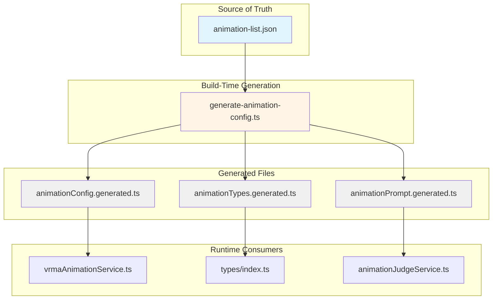
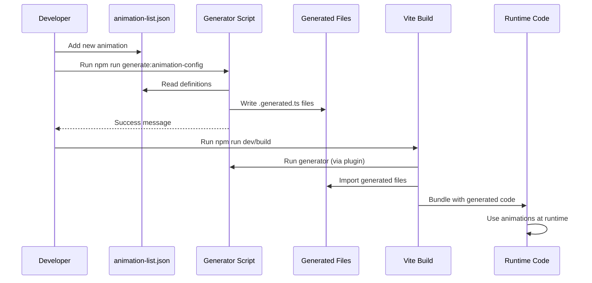

# Single-Source-of-Truth Animation Configuration Architecture

## Executive Summary

This document outlines a code generation-based architecture that establishes [`animation-list.json`](../scripts/animation-list.json) as the single source of truth for all animation configuration. A build-time generator script will derive all other configuration files from this master definition, eliminating manual synchronization and reducing errors.

## Current Architecture Problems

### Four Separate Configuration Locations

| Location | Purpose | Data Format | Synchronization Method |
|----------|---------|-------------|----------------------|
| [`scripts/animation-list.json`](../scripts/animation-list.json) | Master definition for conversion pipeline | JSON (name, mixamoName, category, description) | Manual - source of truth |
| [`src/services/vrmaAnimationService.ts`](../src/services/vrmaAnimationService.ts) | Runtime configuration | Arrays of objects (path, name, description) | Manual copy |
| [`src/types/index.ts`](../src/types/index.ts) | TypeScript type validation | Const arrays of strings | Manual copy |
| [`src/services/animationJudgeService.ts`](../src/services/animationJudgeService.ts) | LLM prompt text | Hardcoded string with categorized list | Manual copy |

### Issues with Current Approach

1. **Manual Synchronization Required**: Adding a new animation requires updates in 4 separate files
2. **Error-Prone**: High risk of inconsistencies between different configuration sources
3. **Conversion Script Output**: Scripts generate code snippets that require manual integration
4. **Maintenance Burden**: Changes to animation metadata must be propagated manually
5. **Type Safety Gaps**: Runtime arrays may diverge from TypeScript type definitions

## Proposed Architecture

### Architecture Overview



### Key Design Decisions

1. **Code Generation Approach**: Build-time generation ensures all derived files are always in sync
2. **Source of Truth**: [`animation-list.json`](../scripts/animation-list.json) remains the authoritative source
3. **Generated File Pattern**: All generated files use `.generated.ts` suffix for easy identification
4. **Vite Integration**: Generator runs automatically as part of the build process
5. **Backward Compatibility**: Existing code continues to work during migration

## File Structure

### New Files

```
scripts/
├── animation-list.json              # Single source of truth (existing)
└── generate-animation-config.ts      # NEW: Code generator script

src/generated/                       # NEW: Generated files directory
├── animationConfig.generated.ts       # Generated runtime config
├── animationTypes.generated.ts        # Generated TypeScript types
└── animationPrompt.generated.ts       # Generated LLM prompt
```

### Modified Files

```
src/
├── services/
│   ├── vrmaAnimationService.ts      # Import from generated config
│   └── animationJudgeService.ts     # Import from generated prompt
└── types/
    └── index.ts                   # Import from generated types
```

### Generated File Details

#### `src/generated/animationConfig.generated.ts`

```typescript
/**
 * AUTO-GENERATED - DO NOT EDIT
 * Generated from scripts/animation-list.json
 * Run: npm run generate:animation-config
 */

import type { VRMAAnimationConfig } from '../services/vrmaAnimationService';

// Core animations from VRM Motion Pack
export const VRMA_CORE_ANIMATIONS: VRMAAnimationConfig[] = [
  { path: '/animations/vrma/VRMA_02.vrma', name: 'greeting', description: 'Greeting animation' },
  { path: '/animations/vrma/VRMA_03.vrma', name: 'peace', description: 'Peace sign animation' },
  // ... generated from animation-list.json
];

// Extended animations from Mixamo (converted from FBX)
export const VRMA_EXTENDED_ANIMATIONS: VRMAAnimationConfig[] = [
  { path: '/animations/vrma/idle.vrma', name: 'idle', description: 'Default standing pose' },
  // ... generated from animation-list.json
];

// Gesture animations
export const VRMA_GESTURE_ANIMATIONS: VRMAAnimationConfig[] = [
  { path: '/animations/vrma/headNod.vrma', name: 'headNod', description: 'Simple head nod' },
  // ... generated from animation-list.json
];

// Breakdance animations
export const VRMA_BREAKDANCE_ANIMATIONS: VRMAAnimationConfig[] = [
  { path: '/animations/vrma/breakdance1990.vrma', name: 'breakdance1990', description: '1990 spin' },
  // ... generated from animation-list.json
];

// Combined list of all animations
export const VRMA_ANIMATIONS: VRMAAnimationConfig[] = [
  ...VRMA_CORE_ANIMATIONS,
  ...VRMA_EXTENDED_ANIMATIONS,
  ...VRMA_GESTURE_ANIMATIONS,
  ...VRMA_BREAKDANCE_ANIMATIONS,
];
```

#### `src/generated/animationTypes.generated.ts`

```typescript
/**
 * AUTO-GENERATED - DO NOT EDIT
 * Generated from scripts/animation-list.json
 * Run: npm run generate:animation-config
 */

// Core animations
export const CORE_ANIMATIONS = [
  'greeting',
  'peace',
  'shoot',
  'spin',
  'modelPose',
  'squat',
] as const;

// Extended animations
export const EXTENDED_ANIMATIONS = [
  'idle',
  'weightShift',
  'talkingOnPhone',
  // ... generated from animation-list.json
] as const;

// Gesture animations
export const GESTURE_ANIMATIONS = [
  'headNod',
  'hardHeadNod',
  // ... generated from animation-list.json
] as const;

// Breakdance animations
export const BREAKDANCE_ANIMATIONS = [
  'breakdance1990',
  'breakdance1990_2',
  // ... generated from animation-list.json
] as const;

// All available animations
export const AVAILABLE_ANIMATIONS = [
  ...CORE_ANIMATIONS,
  ...EXTENDED_ANIMATIONS,
  ...GESTURE_ANIMATIONS,
  ...BREAKDANCE_ANIMATIONS,
] as const;

// Type union of all animation names
export type AnimationName = typeof AVAILABLE_ANIMATIONS[number];
```

#### `src/generated/animationPrompt.generated.ts`

```typescript
/**
 * AUTO-GENERATED - DO NOT EDIT
 * Generated from scripts/animation-list.json
 * Run: npm run generate:animation-config
 */

export const ANIMATION_JUDGE_SYSTEM_PROMPT = `You are an animation director for a 3D avatar. Given a conversation exchange, decide which animations avatar should perform to accompany speaking its response.

Available animations by category:

CORE ANIMATIONS:
- peace: Peace sign/victory pose - use for success, positivity, celebration
- shoot: Finger guns/shooting gesture - use for playful pointing, "gotcha", cool moments
- spin: A playful spinning/twirling motion - use for fun, excitement, showing off
- modelPose: Idle standing pose - use for neutral moments
- thinking: Thinking - use for contemplation

GREETINGS:
- standingGreeting: Standing greeting - use for formal greeting
- waving: Waving - use for greeting or farewell
// ... generated from animation-list.json

Rules:
1. Only trigger animations that naturally match what is avatar is saying
2. Can return multiple animations to be played in sequence with delays
3. Return empty array if no animation fits context
4. Consider the user's request AND the AI's response
5. Be selective - not every response needs an animation
6. If the user explicitly asks for an action (spin, wave, dance, etc), definitely include it
7. Prefer core animations for basic interactions, extended for more specific scenarios`;
```

### Generator Script: `scripts/generate-animation-config.ts`

```typescript
#!/usr/bin/env tsx
/**
 * Animation Configuration Generator
 *
 * Reads scripts/animation-list.json and generates:
 * - src/generated/animationConfig.generated.ts
 * - src/generated/animationTypes.generated.ts
 * - src/generated/animationPrompt.generated.ts
 */

import fs from 'fs';
import path from 'path';
import { fileURLToPath } from 'url';

const __filename = fileURLToPath(import.meta.url);
const __dirname = path.dirname(__filename);

interface AnimationDefinition {
  name: string;
  mixamoName: string;
  category: string;
  description: string;
}

interface AnimationList {
  animations: AnimationDefinition[];
}

function readAnimationList(): AnimationList {
  const jsonPath = path.join(__dirname, 'animation-list.json');
  const content = fs.readFileSync(jsonPath, 'utf-8');
  return JSON.parse(content);
}

function categorizeAnimations(animations: AnimationDefinition[]) {
  const categories: Record<string, AnimationDefinition[]> = {};
  animations.forEach(anim => {
    if (!categories[anim.category]) {
      categories[anim.category] = [];
    }
    categories[anim.category].push(anim);
  });
  return categories;
}

function generateRuntimeConfig(animations: AnimationDefinition[]): string {
  // Generate VRMAAnimationConfig arrays
  // ...
}

function generateTypeDefinitions(animations: AnimationDefinition[]): string {
  // Generate const arrays and type union
  // ...
}

function generateLLMPrompt(animations: AnimationDefinition[]): string {
  // Generate SYSTEM_PROMPT with categorized animations
  // ...
}

function main() {
  const animationList = readAnimationList();
  const categories = categorizeAnimations(animationList.animations);

  // Generate files
  const runtimeConfig = generateRuntimeConfig(animationList.animations);
  const typeDefinitions = generateTypeDefinitions(animationList.animations);
  const llmPrompt = generateLLMPrompt(animationList.animations);

  // Write generated files
  const generatedDir = path.join(__dirname, '..', 'src', 'generated');
  fs.mkdirSync(generatedDir, { recursive: true });

  fs.writeFileSync(
    path.join(generatedDir, 'animationConfig.generated.ts'),
    runtimeConfig
  );

  fs.writeFileSync(
    path.join(generatedDir, 'animationTypes.generated.ts'),
    typeDefinitions
  );

  fs.writeFileSync(
    path.join(generatedDir, 'animationPrompt.generated.ts'),
    llmPrompt
  );

  console.log('✅ Animation configuration files generated successfully');
}

main();
```

## Vite Integration

### Build Process Integration

The generator will be integrated into the Vite build process using a plugin:

```typescript
// vite.config.ts
import { defineConfig } from 'vite';
import react from '@vitejs/plugin-react';
import { execSync } from 'child_process';

function animationConfigPlugin() {
  return {
    name: 'animation-config-generator',
    buildStart() {
      console.log('🎬 Generating animation configuration...');
      try {
        execSync('npx tsx scripts/generate-animation-config.ts', {
          stdio: 'inherit',
          cwd: process.cwd()
        });
      } catch (error) {
        console.error('Failed to generate animation config:', error);
        throw error;
      }
    }
  };
}

export default defineConfig({
  plugins: [react(), animationConfigPlugin()],
  // ... rest of config
});
```

### Package.json Scripts

```json
{
  "scripts": {
    "generate:animation-config": "tsx scripts/generate-animation-config.ts",
    "dev": "vite",
    "build": "npm run generate:animation-config && vite build",
    "lint": "eslint .",
    "preview": "vite preview"
  }
}
```

## Migration Strategy

### Phase 1: Setup (No Breaking Changes)

1. Create `scripts/generate-animation-config.ts` generator script
2. Create `src/generated/` directory
3. Add generator to `package.json` as standalone script
4. Test generator produces correct output
5. Add `.gitignore` entry for `src/generated/` (or commit generated files)

### Phase 2: Gradual Migration

1. Update [`vite.config.ts`](../vite.config.ts) to run generator on build start
2. Update [`src/types/index.ts`](../src/types/index.ts):
   ```typescript
   // Re-export from generated file
   export * from '../generated/animationTypes.generated';
   ```
3. Update [`src/services/vrmaAnimationService.ts`](../src/services/vrmaAnimationService.ts):
   ```typescript
   // Import from generated file
   import {
     VRMA_CORE_ANIMATIONS,
     VRMA_EXTENDED_ANIMATIONS,
     VRMA_GESTURE_ANIMATIONS,
     VRMA_BREAKDANCE_ANIMATIONS,
     VRMA_ANIMATIONS
   } from '../generated/animationConfig.generated';
   ```
4. Update [`src/services/animationJudgeService.ts`](../src/services/animationJudgeService.ts):
   ```typescript
   // Import from generated file
   import { ANIMATION_JUDGE_SYSTEM_PROMPT } from '../generated/animationPrompt.generated';
   const SYSTEM_PROMPT = ANIMATION_JUDGE_SYSTEM_PROMPT;
   ```

### Phase 3: Cleanup

1. Remove hardcoded arrays from [`src/services/vrmaAnimationService.ts`](../src/services/vrmaAnimationService.ts)
2. Remove hardcoded arrays from [`src/types/index.ts`](../src/types/index.ts)
3. Remove hardcoded `SYSTEM_PROMPT` from [`src/services/animationJudgeService.ts`](../src/services/animationJudgeService.ts)
4. Update conversion scripts to reference [`animation-list.json`](../scripts/animation-list.json) only

### Phase 4: Validation

1. Run full test suite to ensure no regressions
2. Verify new animation addition workflow:
   - Add to [`animation-list.json`](../scripts/animation-list.json)
   - Run `npm run generate:animation-config`
   - Verify all files updated correctly
3. Update documentation

## Naming Conventions

### Source File: `animation-list.json`

- **Field names**: camelCase (`mixamoName`, not `mixamo_name`)
- **Animation names**: camelCase (`happyIdle`, not `happy_idle`)
- **Categories**: lowercase (`idle`, `action`, `gesture`)

### Generated Files

- **File suffix**: `.generated.ts` (indicates auto-generated)
- **Export names**: PascalCase for types, UPPER_CASE for constants
- **File organization**: One concern per file

### Code Style

- **Comments**: Auto-generated header with generation command
- **Formatting**: Prettier-compatible output
- **Type safety**: Full TypeScript types exported

## Build Tooling Requirements

### Dependencies

- **TypeScript**: For type-safe generation
- **tsx**: For running TypeScript scripts in Node.js
- **fs/path**: Node.js built-in modules (no additional dependencies)

### Development Workflow



### Error Handling

The generator should:

1. **Validate JSON structure** before processing
2. **Report duplicates** in animation names
3. **Warn about missing fields** in animation definitions
4. **Fail gracefully** with clear error messages
5. **Generate valid TypeScript** even with partial data

## Benefits

### Immediate Benefits

1. **Single Point of Change**: Add animation in one place
2. **Automatic Synchronization**: All files stay in sync
3. **Reduced Errors**: No manual copy-paste required
4. **Type Safety**: Types always match runtime data
5. **Developer Experience**: Faster animation addition workflow

### Long-term Benefits

1. **Easier Maintenance**: Changes propagate automatically
2. **Better Testing**: Generated files can be tested for correctness
3. **Documentation**: Single source of truth for animation catalog
4. **Extensibility**: Easy to add new derived outputs
5. **CI/CD Friendly**: Automated generation in build pipeline

## Future Enhancements

### Potential Improvements

1. **Animation Metadata Expansion**: Add duration, layer priority, tags to JSON
2. **Validation Script**: Check for missing VRMA files
3. **Documentation Generator**: Auto-generate animation catalog docs
4. **Category-based Imports**: Generate category-specific modules
5. **Hot Reload**: Watch mode for development

### Extension Points

The generator architecture supports:

- **Custom output formats**: Add new `.generated.ts` files
- **Transformation pipelines**: Process animations before output
- **External data sources**: Import from other JSON files
- **Validation rules**: Enforce naming conventions

## Appendix: Example Workflow

### Adding a New Animation

**Before (Current):**

1. Edit [`scripts/animation-list.json`](../scripts/animation-list.json)
2. Add entry to [`src/services/vrmaAnimationService.ts`](../src/services/vrmaAnimationService.ts)
3. Add name to [`src/types/index.ts`](../src/types/index.ts)
4. Add description to [`src/services/animationJudgeService.ts`](../src/services/animationJudgeService.ts)

**After (Proposed):**

1. Edit [`scripts/animation-list.json`](../scripts/animation-list.json)
2. Run `npm run generate:animation-config` (automatic in build)

### Conversion Script Integration

The existing [`convert-new-animations.js`](../scripts/convert-new-animations.js) script will be updated to:

1. Read from [`animation-list.json`](../scripts/animation-list.json) only
2. Generate VRMA files
3. Run generator automatically
4. Output: "Configuration files updated. Ready to use."

## Conclusion

This architecture establishes [`animation-list.json`](../scripts/animation-list.json) as the definitive source of truth for animation configuration. Through build-time code generation, all consuming locations automatically derive their data from this single source, eliminating manual synchronization and reducing errors. The phased migration approach ensures backward compatibility while providing a clear path to the new system.
