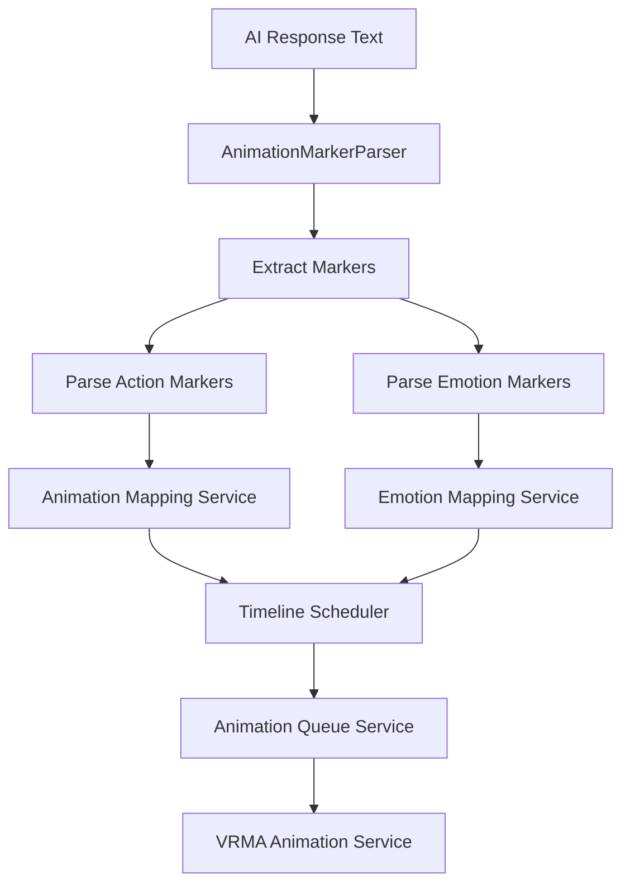
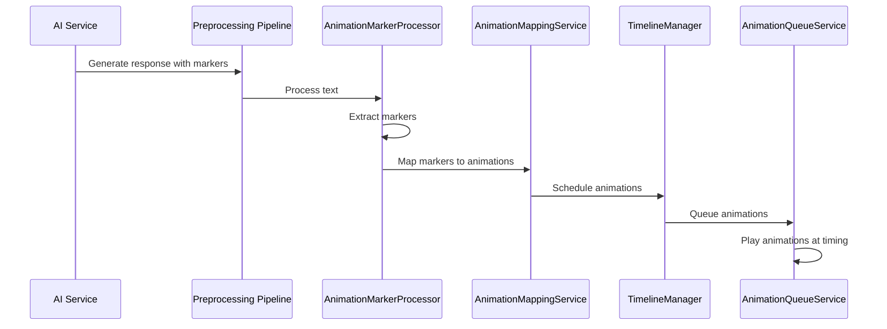

# Text-Based Animation Parsing System Design

## Overview

This document describes a text-based animation parsing system that enables AI-generated text to include explicit emotion and action indicators. The system parses these indicators from text (similar to a play script format) and maps them to available VRMA animations for the 3D avatar.

## Table of Contents

1. [Text Format Specification](#text-format-specification)
2. [Parser Architecture](#parser-architecture)
3. [System Prompt Template](#system-prompt-template)
4. [Animation Mapping Configuration](#animation-mapping-configuration)
5. [Integration with Existing Systems](#integration-with-existing-systems)
6. [Conflict Resolution Strategy](#conflict-resolution-strategy)

---

## 1. Text Format Specification

### 1.1 Marker Syntax

The text format uses bracketed markers similar to play script notation. Two types of markers are supported:

#### Action Markers
Actions indicate physical movements the avatar should perform.

**Syntax:** `[action_name]` or `[action_name:modifier]`

**Examples:**
```
Hello! [waves] How are you today? [nods]
Let me show you something... [points]
I'm so happy! [jumps]
```

#### Emotion Markers
Emotions indicate the emotional state that should be expressed.

**Syntax:** `(emotion_name)` or `(emotion_name:intensity)`

**Examples:**
```
(happy) I'm really excited to see you!
(surprised) Wow, that's amazing!
(sad) I'm sorry to hear that.
```

### 1.2 Modifier Syntax

Modifiers provide additional control over animations.

**Intensity Modifier:**
```
[nods:strong]      - Strong head nod
[nods:slight]     - Subtle head nod
(happy:high)       - Very happy expression
```

**Duration Modifier:**
```
[thinking:2s]      - Think for 2 seconds
[waits:3s]        - Pause/wait for 3 seconds
```

**Timing Position Modifier:**
```
[start][waves]Hello!    - Animation starts at beginning
...middle of sentence...[nods]... - Animation at word position
[end][shrugs]I don't know  - Animation at end
```

### 1.3 Combined Markers

Multiple markers can be combined:

```
[waves:enthusiastic](happy) Hello there! [nods:slight](thoughtful) Let me think about that...
```

### 1.4 Emphasis Markers

Emphasis can be indicated with asterisks (already supported by existing `PunctuationProcessor`):

```
I *really* appreciate your help!
This is *very* important.
```

### 1.5 Complete Example

```
[start][waves:enthusiastic](happy) Hello! Welcome to the show!

I'm so excited to be here today. [jumps]

(happy) Let me tell you about something amazing...

[points:forward] Look at this incredible feature!

(thoughtful)[nods:slight] I think you'll really like it.

(end)[bows:deep] Thank you for listening!
```

---

## 2. Parser Architecture

### 2.1 System Overview



### 2.2 New Components

#### AnimationMarkerParser (New Service)

**Location:** `src/services/animationMarkerParser.ts`

**Responsibilities:**
- Extract action and emotion markers from text
- Parse modifiers (intensity, duration, timing)
- Remove markers from clean text (for TTS)
- Preserve markers in display text (for UI)
- Return structured marker data

**Interface:**
```typescript
interface AnimationMarker {
  type: 'action' | 'emotion';
  name: string;
  modifiers: {
    intensity?: 'slight' | 'normal' | 'strong' | 'enthusiastic' | 'deep';
    duration?: number; // in seconds
    timing?: 'start' | 'end' | 'word';
  };
  position: number; // Character position in text
  rawText: string; // Original marker text
}

interface ParsedAnimationText {
  original: string;
  cleanText: string;      // For TTS (markers removed)
  displayText: string;    // For UI (markers preserved)
  markers: AnimationMarker[];
}
```

#### AnimationMappingService (New Service)

**Location:** `src/services/animationMappingService.ts`

**Responsibilities:**
- Map action marker names to VRMA animation names
- Handle fuzzy matching for similar action names
- Apply intensity modifiers to select animation variants
- Provide fallback animations for unknown markers

**Interface:**
```typescript
interface AnimationMapping {
  markerName: string;
  animationName: string;
  layer: AnimationLayerType;
  defaultDuration: number;
  variants?: {
    slight?: string;
    strong?: string;
    enthusiastic?: string;
    deep?: string;
  };
}

class AnimationMappingService {
  mapMarkerToAnimation(marker: AnimationMarker): QueuedAnimation | null;
  getFallbackAnimation(markerName: string): string;
  registerCustomMapping(mapping: AnimationMapping): void;
}
```

#### EmotionMappingService (New Service)

**Location:** `src/services/emotionMappingService.ts`

**Responsibilities:**
- Map emotion markers to facial expressions
- Map emotions to idle state animations
- Handle emotion intensity
- Blend between emotions

**Interface:**
```typescript
interface EmotionMapping {
  emotionName: string;
  facialExpression?: string;
  idleAnimation?: string;
  blendDuration: number;
}

class EmotionMappingService {
  mapEmotionToAnimation(emotion: string, intensity?: string): string | null;
  getEmotionBlend(from: string, to: string): number;
}
```

### 2.3 Integration with Preprocessing Pipeline

The `AnimationMarkerParser` will be added as a new processor in the existing preprocessing pipeline.

**Location:** `src/services/textPreprocessing/processors/AnimationMarkerProcessor.ts`

**Priority:** 15 (between PunctuationProcessor and EmojiProcessor)

**Processor Implementation:**
```typescript
export class AnimationMarkerProcessor extends BaseProcessor {
  name = 'animationMarker';
  priority = 15;
  
  process(text: string, metadata: TextMetadata) {
    const parser = new AnimationMarkerParser();
    const result = parser.parse(text);
    
    // Add animation markers to metadata
    const newMetadata = this.cloneMetadata(metadata);
    newMetadata.animationMarkers = result.markers;
    
    return {
      cleanText: result.cleanText,
      displayText: result.displayText,
      metadata: newMetadata
    };
  }
}
```

### 2.4 Parser Algorithm

```
1. Scan text for marker patterns:
   - Action: \[(\w+)(?::(\w+))?\]
   - Emotion: \((\w+)(?::(\w+))?\)

2. For each marker found:
   a. Extract marker type (action/emotion)
   b. Extract marker name
   c. Parse modifiers (intensity, duration, timing)
   d. Record position in text

3. Generate clean text:
   - Remove all markers from text

4. Generate display text:
   - Preserve markers for UI rendering

5. Return structured result
```

---

## 3. System Prompt Template

### 3.1 Context Section

```
You are an AI assistant in a 3D avatar chat application. Your responses will be 
enacted by a 3D avatar that can perform animations and express emotions.

IMPORTANT: You should use animation and emotion markers in your text to guide 
the avatar's performance. This is similar to a play script format where stage 
directions are provided for the actor.
```

### 3.2 Marker Syntax Instructions

```
Use the following marker syntax:

ACTION MARKERS (physical movements):
- [waves] - Wave hello/goodbye
- [nods] - Nod head in agreement
- [shrugs] - Shrug shoulders
- [points] - Point at something
- [jumps] - Jump up
- [bows] - Bow down
- [claps] - Clap hands
- [waves:enthusiastic] - Enthusiastic wave
- [nods:strong] - Strong nod
- [nods:slight] - Subtle nod

EMOTION MARKERS (emotional state):
- (happy) - Happy expression
- (sad) - Sad expression
- (surprised) - Surprised expression
- (thoughtful) - Thinking expression
- (angry) - Angry expression
- (happy:high) - Very happy
- (surprised:slight) - Mildly surprised

TIMING MODIFIERS:
- [start][waves]Hello! - Animation at start
- ...[nods]... - Animation at word position
- Goodbye![waves][end] - Animation at end
```

### 3.3 Available Animations

```
AVAILABLE ACTIONS:
- Greetings: waving, greeting, standingGreeting, shakingHands1
- Head Gestures: headNod, shakingHeadNo, hardHeadNod, lengthyHeadNod
- Hand Gestures: pointing, beckoning, acknowledging, dismissingGesture
- Social: bowing, salute, clapping, shrugging
- Movement: jumping, spinning, walking, dancing
- Combat: punch, kick, block, reload
- Performance: guitarPlaying, pianoPlaying, singing

AVAILABLE EMOTIONS:
- happy, sad, surprised, angry, thoughtful, bashful
- disappointed, relieved, nervous, confident, beingCocky
```

### 3.4 Guidelines

```
GUIDELINES FOR USING MARKERS:

1. Be selective - not every sentence needs a marker
2. Match markers to the emotional content of your response
3. Use action markers when describing physical actions
4. Use emotion markers to set the overall tone
5. Combine action and emotion markers for rich expression
6. Place markers at natural pause points in speech
7. Use intensity modifiers to express nuance
8. Avoid overusing markers (1-2 per sentence is typical)

EXAMPLES:

Good:
"[waves:enthusiastic](happy) Hello! I'm so excited to meet you!
(nods) That's a great question. [points:forward] Let me show you..."

Bad (too many markers):
"[waves](happy)[nods][jumps]Hello![claps][spins]How[points]are[nods]you?"

Bad (no markers):
"Hello! I'm excited to meet you. That's a great question."
```

### 3.5 Examples Section

```
EXAMPLE 1 - Greeting:
User: Hi there!
AI: [waves:enthusiastic](happy) Hello! Welcome to the chat!

EXAMPLE 2 - Agreement:
User: Do you agree with that?
AI: (thoughtful) That's an interesting point... [nods:strong] Yes, I agree!

EXAMPLE 3 - Surprise:
User: Guess what happened?
AI: (surprised) Oh! What happened?

EXAMPLE 4 - Explanation:
User: Can you explain how it works?
AI: [points:forward] Here's how it works...
(nods) First, you press this button.
[points:right] Then, you select this option.

EXAMPLE 5 - Farewell:
User: I have to go now.
AI: (happy) It was great talking with you! [waves] Goodbye!
```

---

## 4. Animation Mapping Configuration

### 4.1 Action Marker Mappings

```typescript
// Location: src/config/animationMarkerMappings.ts

export const ACTION_MARKER_MAPPINGS: Record<string, AnimationMapping> = {
  // Greetings
  'waves': {
    markerName: 'waves',
    animationName: 'waving',
    layer: 'upper_body',
    defaultDuration: 2500,
    variants: {
      slight: 'acknowledging',
      normal: 'waving',
      strong: 'standingClap',
      enthusiastic: 'standingGreeting'
    }
  },
  'greeting': {
    markerName: 'greeting',
    animationName: 'greeting',
    layer: 'upper_body',
    defaultDuration: 3000,
    variants: {
      slight: 'acknowledging',
      normal: 'greeting',
      enthusiastic: 'standingGreeting'
    }
  },

  // Head Gestures
  'nods': {
    markerName: 'nods',
    animationName: 'headNod',
    layer: 'gesture',
    defaultDuration: 2000,
    variants: {
      slight: 'acknowledging',
      normal: 'headNod',
      strong: 'hardHeadNod',
      enthusiastic: 'lengthyHeadNod'
    }
  },
  'shakes': {
    markerName: 'shakes',
    animationName: 'shakingHeadNo',
    layer: 'gesture',
    defaultDuration: 2000,
    variants: {
      slight: 'thoughtfulHeadShake',
      normal: 'shakingHeadNo',
      strong: 'annoyedHeadShake'
    }
  },

  // Hand Gestures
  'points': {
    markerName: 'points',
    animationName: 'pointing',
    layer: 'upper_body',
    defaultDuration: 2000
  },
  'beckons': {
    markerName: 'beckons',
    animationName: 'beckoning',
    layer: 'upper_body',
    defaultDuration: 2000
  },
  'shrugs': {
    markerName: 'shrugs',
    animationName: 'shrugging',
    layer: 'upper_body',
    defaultDuration: 2000
  },
  'claps': {
    markerName: 'claps',
    animationName: 'standingClap',
    layer: 'upper_body',
    defaultDuration: 2000
  },
  'acknowledges': {
    markerName: 'acknowledges',
    animationName: 'acknowledging',
    layer: 'gesture',
    defaultDuration: 2000
  },

  // Social
  'bows': {
    markerName: 'bows',
    animationName: 'bowing',
    layer: 'full_body',
    defaultDuration: 3500,
    variants: {
      slight: 'acknowledging',
      normal: 'bowing',
      deep: 'standingGreeting'
    }
  },
  'salutes': {
    markerName: 'salutes',
    animationName: 'salute',
    layer: 'upper_body',
    defaultDuration: 2500
  },

  // Movement
  'jumps': {
    markerName: 'jumps',
    animationName: 'jumping',
    layer: 'full_body',
    defaultDuration: 2000
  },
  'spins': {
    markerName: 'spins',
    animationName: 'spin',
    layer: 'full_body',
    defaultDuration: 4000
  },
  'dances': {
    markerName: 'dances',
    animationName: 'sillyDancing',
    layer: 'full_body',
    defaultDuration: 5000
  },

  // Combat
  'punches': {
    markerName: 'punches',
    animationName: 'punch',
    layer: 'upper_body',
    defaultDuration: 1500
  },
  'kicks': {
    markerName: 'kicks',
    animationName: 'dropKick',
    layer: 'full_body',
    defaultDuration: 2500
  },

  // Performance
  'plays_guitar': {
    markerName: 'plays_guitar',
    animationName: 'guitarPlaying',
    layer: 'full_body',
    defaultDuration: 4000
  },
  'plays_piano': {
    markerName: 'plays_piano',
    animationName: 'pianoPlaying',
    layer: 'full_body',
    defaultDuration: 4000
  },
  'sings': {
    markerName: 'sings',
    animationName: 'singing',
    layer: 'full_body',
    defaultDuration: 5000
  }
};
```

### 4.2 Emotion Marker Mappings

```typescript
// Location: src/config/emotionMarkerMappings.ts

export const EMOTION_MARKER_MAPPINGS: Record<string, EmotionMapping> = {
  'happy': {
    emotionName: 'happy',
    facialExpression: 'happy',
    idleAnimation: 'happyIdle',
    blendDuration: 300
  },
  'sad': {
    emotionName: 'sad',
    facialExpression: 'sad',
    idleAnimation: 'sadIdle',
    blendDuration: 500
  },
  'surprised': {
    emotionName: 'surprised',
    facialExpression: 'surprised',
    idleAnimation: 'modelPose',
    blendDuration: 200
  },
  'angry': {
    emotionName: 'angry',
    facialExpression: 'angry',
    idleAnimation: 'angryGesture',
    blendDuration: 300
  },
  'thoughtful': {
    emotionName: 'thoughtful',
    facialExpression: 'thoughtful',
    idleAnimation: 'thinking',
    blendDuration: 400
  },
  'bashful': {
    emotionName: 'bashful',
    facialExpression: 'bashful',
    idleAnimation: 'bashful',
    blendDuration: 500
  },
  'disappointed': {
    emotionName: 'disappointed',
    facialExpression: 'disappointed',
    idleAnimation: 'disappointed',
    blendDuration: 400
  },
  'relieved': {
    emotionName: 'relieved',
    facialExpression: 'relieved',
    idleAnimation: 'relievedSigh',
    blendDuration: 500
  },
  'nervous': {
    emotionName: 'nervous',
    facialExpression: 'nervous',
    idleAnimation: 'nervouslyLookAround',
    blendDuration: 300
  },
  'confident': {
    emotionName: 'confident',
    facialExpression: 'confident',
    idleAnimation: 'beingCocky',
    blendDuration: 300
  }
};
```

### 4.3 Fallback Strategy

```typescript
// Location: src/config/animationMarkerMappings.ts

export const MARKER_FALLBACKS: Record<string, string> = {
  // Unknown actions fall back to acknowledging gesture
  'default_action': 'acknowledging',
  
  // Unknown emotions fall back to neutral
  'default_emotion': 'modelPose',
  
  // Specific fallbacks for common variations
  'wave': 'waving',
  'nod': 'headNod',
  'shake': 'shakingHeadNo',
  'point': 'pointing',
  'shrug': 'shrugging',
  'clap': 'standingClap',
  'bow': 'bowing',
  'jump': 'jumping',
  'spin': 'spin',
  'dance': 'sillyDancing',
  'punch': 'punch',
  'kick': 'dropKick'
};

export function getFallbackForMarker(markerName: string, type: 'action' | 'emotion'): string {
  // Try direct match first
  if (MARKER_FALLBACKS[markerName]) {
    return MARKER_FALLBACKS[markerName];
  }
  
  // Try fuzzy match (singular/plural, similar words)
  const fuzzyMatch = findFuzzyMatch(markerName, Object.keys(MARKER_FALLBACKS));
  if (fuzzyMatch) {
    return MARKER_FALLBACKS[fuzzyMatch];
  }
  
  // Use default fallback
  return type === 'action' ? MARKER_FALLBACKS['default_action'] : MARKER_FALLBACKS['default_emotion'];
}
```

---

## 5. Integration with Existing Systems

### 5.1 Text Processing Flow



### 5.2 Type Extensions

Add to `src/types/index.ts`:

```typescript
// Extend TextMetadata to include animation markers
export interface TextMetadata {
  emphasis: EmphasisData[];
  emojis: EmojiData[];
  links: LinkData[];
  animationMarkers: AnimationMarker[];  // NEW
}

// Animation marker types
export type AnimationMarkerType = 'action' | 'emotion';

export interface AnimationMarker {
  type: AnimationMarkerType;
  name: string;
  modifiers: {
    intensity?: AnimationIntensity;
    duration?: number;
    timing?: AnimationTiming;
  };
  position: number;
  rawText: string;
}

export type AnimationIntensity = 'slight' | 'normal' | 'strong' | 'enthusiastic' | 'deep';

export type AnimationTiming = 'start' | 'end' | 'word';

// Parsed text result
export interface ParsedAnimationText {
  original: string;
  cleanText: string;
  displayText: string;
  markers: AnimationMarker[];
}
```

### 5.3 Timeline Scheduling

The parsed markers are converted to timeline events:

```typescript
// Location: src/services/animationMarkerScheduler.ts

export class AnimationMarkerScheduler {
  scheduleMarkersFromText(
    text: string,
    audioDuration: number,
    timelineManager: TimelineManager
  ): void {
    // Parse text for markers
    const parsed = animationMarkerParser.parse(text);
    
    // Calculate timing for each marker
    parsed.markers.forEach(marker => {
      const timing = this.calculateMarkerTiming(
        marker,
        text,
        audioDuration
      );
      
      // Map marker to animation
      const animation = animationMappingService.mapMarkerToAnimation(marker);
      
      if (animation) {
        // Schedule on timeline
        timelineManager.schedule({
          id: `marker_${marker.position}`,
          timestamp: timing,
          type: 'animation',
          data: animation,
          callback: () => animationQueueService.playAnimation(animation)
        });
      }
    });
  }
  
  private calculateMarkerTiming(
    marker: AnimationMarker,
    text: string,
    audioDuration: number
  ): number {
    // If explicit timing modifier, use it
    if (marker.modifiers.timing === 'start') {
      return 0;
    }
    if (marker.modifiers.timing === 'end') {
      return audioDuration - 1000;
    }
    
    // Otherwise, estimate based on character position
    const characterPosition = marker.position / text.length;
    return characterPosition * audioDuration;
  }
}
```

### 5.4 Chat Interface Integration

Modify `src/components/ChatInterface.tsx` to use the new parser:

```typescript
// In the message processing flow
async function processAIResponse(response: string) {
  // 1. Preprocess text (includes animation marker extraction)
  const preprocessed = preprocessingPipeline.process(response);
  
  // 2. Get TTS audio
  const ttsResult = await speechService.synthesize(preprocessed.cleanText);
  
  // 3. Schedule animation markers on timeline
  if (preprocessed.metadata.animationMarkers?.length > 0) {
    animationMarkerScheduler.scheduleMarkersFromText(
      response,
      ttsResult.duration,
      timelineManager
    );
  }
  
  // 4. Otherwise, fall back to LLM judgment
  else {
    const judgment = await animationJudgeService.judgeAnimations(
      lastUserMessage,
      response
    );
    // Schedule LLM-judged animations...
  }
  
  // 5. Play audio and start timeline
  speechService.play(ttsResult.audioBuffer);
  timelineManager.start(ttsResult.duration);
}
```

---

## 6. Conflict Resolution Strategy

### 6.1 Priority Hierarchy

When multiple animation sources conflict, use this priority:

1. **Explicit Markers** (highest priority)
   - User/AI explicitly requested animation via text marker
   - Always honored

2. **LLM Judgment**
   - Used when no explicit markers present
   - Provides contextual animation suggestions

3. **Emoji Triggers**
   - Fallback for simple emotional cues
   - Lowest priority

### 6.2 Conflict Scenarios

#### Scenario 1: Marker + LLM Judgment Both Present

**Resolution:** Use marker, log LLM suggestion for learning

```typescript
if (hasExplicitMarkers && hasLLMJudgment) {
  // Use explicit markers
  scheduleMarkers(markers);
  
  // Log LLM judgment for potential future improvements
  console.log('LLM suggested:', llmJudgment.animations);
  console.log('Using explicit markers instead');
}
```

#### Scenario 2: Conflicting Markers

**Resolution:** Use first marker, log conflict

```typescript
if (hasConflictingMarkers) {
  // Use first marker in reading order
  const primaryMarker = markers[0];
  scheduleMarker(primaryMarker);
  
  // Log conflict
  console.warn('Conflicting markers detected:', markers);
}
```

#### Scenario 3: Unknown Marker

**Resolution:** Use fallback, log for mapping improvement

```typescript
if (!isKnownMarker(marker.name)) {
  const fallback = getFallbackForMarker(marker.name, marker.type);
  scheduleMarker(fallback);
  
  // Log unknown marker
  console.warn('Unknown marker:', marker.name, 'Using fallback:', fallback);
}
```

### 6.3 Conflict Prevention

Add validation to prevent conflicts:

```typescript
export class AnimationMarkerValidator {
  validateMarkers(markers: AnimationMarker[]): ValidationResult {
    const issues: ValidationIssue[] = [];
    
    // Check for conflicts
    const conflicts = this.detectConflicts(markers);
    if (conflicts.length > 0) {
      issues.push({
        type: 'conflict',
        message: 'Conflicting animation markers',
        markers: conflicts
      });
    }
    
    // Check for unknown markers
    const unknown = this.detectUnknownMarkers(markers);
    if (unknown.length > 0) {
      issues.push({
        type: 'unknown',
        message: 'Unknown animation markers',
        markers: unknown
      });
    }
    
    return {
      valid: issues.length === 0,
      issues
    };
  }
}
```

---

## 7. Implementation Phases

### Phase 1: Core Parser
- [ ] Create `AnimationMarkerParser` class
- [ ] Implement marker extraction regex patterns
- [ ] Add `AnimationMarkerProcessor` to preprocessing pipeline
- [ ] Extend `TextMetadata` type

### Phase 2: Mapping Services
- [ ] Create `AnimationMappingService`
- [ ] Create `EmotionMappingService`
- [ ] Define marker-to-animation mappings
- [ ] Implement fallback logic

### Phase 3: Timeline Integration
- [ ] Create `AnimationMarkerScheduler`
- [ ] Implement timing calculation
- [ ] Integrate with `TimelineManager`

### Phase 4: System Prompt
- [ ] Create system prompt template
- [ ] Document available animations
- [ ] Provide examples for AI

### Phase 5: Testing & Refinement
- [ ] Test marker extraction
- [ ] Test animation mapping
- [ ] Test timeline scheduling
- [ ] Refine mappings based on results

---

## 8. Configuration

### Environment Variables

```env
# Enable/disable marker-based animations
VITE_ENABLE_MARKER_ANIMATIONS=true

# Fallback to LLM judgment if no markers
VITE_USE_LLM_JUDGMENT_FALLBACK=true

# Log unknown markers for mapping improvement
VITE_LOG_UNKNOWN_MARKERS=true
```

---

## 9. Future Enhancements

### 9.1 Advanced Timing

- Support millisecond-precise timing: `[waves@1500ms]`
- Support relative timing: `[nods@+500ms]` (500ms after previous)

### 9.2 Composite Animations

- Support simultaneous animations: `[waves][nods]`
- Support layered animations: `[waves:upper][nods:head]`

### 9.3 Learning System

- Track which markers are used most
- Automatically suggest new mappings
- Learn from LLM judgment patterns

### 9.4 Custom Mappings

- Allow users to define custom marker mappings
- Persist mappings to local storage
- Share mappings between sessions
