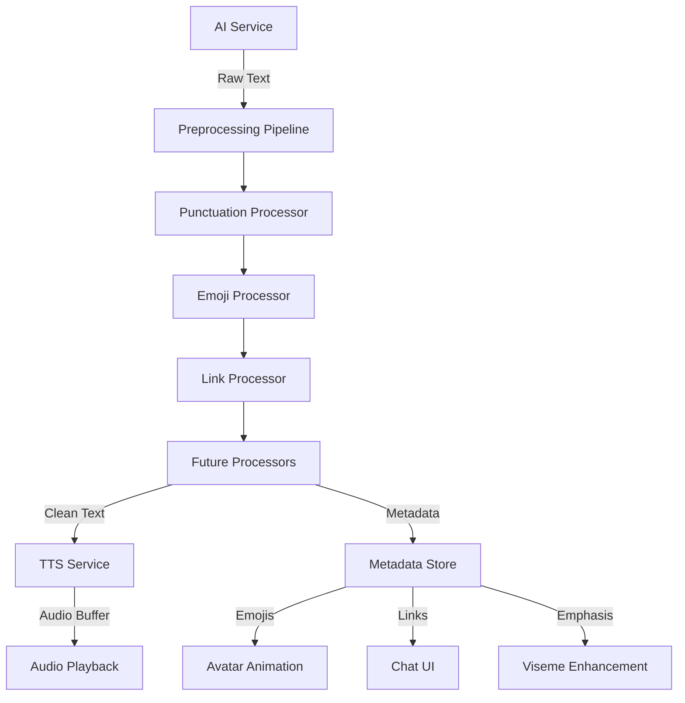

# Text Preprocessing System - Technical Specification

**Version:** 1.0  
**Status:** Draft  
**Date:** 2025-12-26  
**Author:** Architecture Team

---

## Table of Contents

1. [Overview](#overview)
2. [Architecture Overview](#architecture-overview)
3. [Type Definitions](#type-definitions)
4. [Processor Specifications](#processor-specifications)
5. [Integration Plan](#integration-plan)
6. [Extensibility Design](#extensibility-design)
7. [Configuration](#configuration)
8. [Testing Strategy](#testing-strategy)
9. [Migration Path](#migration-path)

---

## Overview

### Purpose

The Text Preprocessing System (TPS) is designed to parse and transform AI model output before it is sent to the Text-to-Speech (TTS) engine. The system extracts metadata (emojis, links, emphasis markers) for avatar animation and UI rendering while providing clean, speech-ready text for audio synthesis.

### Current Pipeline

```
User Input → AI Service → Raw Text → TTS → Audio
                          ↓
                      Viseme Generation
```

### Target Pipeline

```
User Input → AI Service → Raw Text → Text Preprocessing System → Clean Text → TTS → Audio
                                              ↓
                                          Metadata Store → Avatar Animation / UI Rendering
```

### Key Requirements

1. **Punctuation Processing** - Detect and handle emphasis markers (e.g., `*emphasis*`)
2. **Emoji Processing** - Extract emojis for gesture mapping while removing from speech
3. **Link Processing** - Detect URLs and handle them appropriately
4. **Extensibility** - Plugin-based architecture for future processors

---

## Architecture Overview

### System Components

```
┌─────────────────────────────────────────────────────────────────────────────┐
│                           Text Preprocessing System                          │
├─────────────────────────────────────────────────────────────────────────────┤
│                                                                             │
│  ┌─────────────────────────────────────────────────────────────────────┐   │
│  │                    PreprocessingPipeline                             │   │
│  │  ┌──────────────┐  ┌──────────────┐  ┌──────────────┐  ┌───────────┐ │   │
│  │  │   Punctuation│  │     Emoji   │  │     Link    │  │  Future   │ │   │
│  │  │   Processor  │  │   Processor │  │  Processor  │  │Processor  │ │   │
│  │  └──────────────┘  └──────────────┘  └──────────────┘  └───────────┘ │   │
│  └─────────────────────────────────────────────────────────────────────┘   │
│                                                                             │
│  ┌─────────────────────────────────────────────────────────────────────┐   │
│  │                    ProcessorRegistry                                │   │
│  │  Manages processor registration, ordering, and execution             │   │
│  └─────────────────────────────────────────────────────────────────────┘   │
│                                                                             │
└─────────────────────────────────────────────────────────────────────────────┘
```

### File Structure

```
src/
├── services/
│   └── textPreprocessing/
│       ├── index.ts                    # Main export
│       ├── pipeline.ts                 # Pipeline orchestrator
│       ├── registry.ts                 # Processor registry
│       ├── processors/
│       │   ├── index.ts                # Processor exports
│       │   ├── baseProcessor.ts        # Abstract base class
│       │   ├── punctuationProcessor.ts # Punctuation/emphasis handling
│       │   ├── emojiProcessor.ts       # Emoji extraction and mapping
│       │   └── linkProcessor.ts        # URL detection and handling
│       ├── types.ts                    # Preprocessing-specific types
│       └── config.ts                   # Default configuration
├── types/
│   └── preprocessing.ts                # Extended type definitions
└── store/
    └── chatStore.ts                    # Extended with metadata support
```

### Data Flow Diagram



### Pipeline Design Pattern

The system uses a **Pipeline Pattern** with the following characteristics:

- **Sequential Processing**: Each processor transforms the text and accumulates metadata
- **Immutable State**: Each processor receives the output of the previous processor
- **Composable**: Processors can be added, removed, or reordered without affecting others
- **Independent**: Each processor has no knowledge of other processors

---

## Type Definitions

### Core Preprocessing Types

```typescript
// src/types/preprocessing.ts

/**
 * Represents a single emphasis marker found in text
 */
export interface EmphasisMarker {
  type: 'asterisk' | 'caps';
  text: string;
  startIndex: number;
  endIndex: number;
  level: number; // 1-3 for nested emphasis
}

/**
 * Represents an emoji found in text
 */
export interface EmojiMetadata {
  emoji: string;
  unicode: string;
  startIndex: number;
  endIndex: number;
  description: string;
  category: EmojiCategory;
  gesture?: GestureMapping; // Mapped avatar gesture
}

/**
 * Emoji categories for gesture mapping
 */
export type EmojiCategory =
  | 'happy'
  | 'sad'
  | 'surprised'
  | 'thinking'
  | 'angry'
  | 'love'
  | 'celebration'
  | 'neutral';

/**
 * Avatar gesture mapping for emojis
 */
export interface GestureMapping {
  animation: string;
  duration: number;
  blendWeight: number;
}

/**
 * Represents a URL found in text
 */
export interface LinkMetadata {
  url: string;
  displayText?: string;
  startIndex: number;
  endIndex: number;
  protocol: 'http' | 'https' | 'www';
  replacementText?: string; // Text to speak instead of URL
}

/**
 * Complete metadata extracted from text
 */
export interface TextMetadata {
  emphasis: EmphasisMarker[];
  emojis: EmojiMetadata[];
  links: LinkMetadata[];
  // Future extensions
  emotions?: EmotionMarker[];
  poses?: PoseMarker[];
  canvasCommands?: CanvasCommand[];
}

/**
 * Result of preprocessing
 */
export interface PreprocessedText {
  cleanText: string;           // Text ready for TTS
  displayText: string;          // Text with formatting for UI
  metadata: TextMetadata;       // Extracted metadata
  originalText: string;         // Original text for reference
  processingTime: number;       // Time taken to process (ms)
}
```

### Processor Interface Types

```typescript
/**
 * Input for a processor
 */
export interface ProcessorInput {
  text: string;
  metadata: TextMetadata;
  originalText: string;
}

/**
 * Output from a processor
 */
export interface ProcessorOutput {
  text: string;
  metadata: TextMetadata;
  modified: boolean; // Whether the text was modified
}

/**
 * Processor configuration
 */
export interface ProcessorConfig {
  enabled: boolean;
  priority: number; // Lower numbers execute first
  options: Record<string, unknown>;
}

/**
 * Base processor interface
 */
export interface ITextProcessor {
  readonly name: string;
  readonly version: string;
  readonly config: ProcessorConfig;
  
  /**
   * Process text and extract metadata
   */
  process(input: ProcessorInput): Promise<ProcessorOutput>;
  
  /**
   * Validate processor configuration
   */
  validate(): boolean;
  
  /**
   * Reset processor state
   */
  reset(): void;
}
```

### Extended Message Types

```typescript
/**
 * Extended message type with preprocessing metadata
 */
export interface ProcessedMessage extends Message {
  preprocessing?: PreprocessedText;
}

/**
 * Extended chat state with metadata support
 */
export interface ExtendedChatState extends ChatState {
  messages: ProcessedMessage[];
  setProcessedMessage: (message: Omit<ProcessedMessage, 'id' | 'timestamp'>) => void;
}
```

---

## Processor Specifications

### Base Processor

**File:** `src/services/textPreprocessing/processors/baseProcessor.ts`

**Purpose:** Abstract base class defining the contract for all processors.

**Interface:**

```typescript
export abstract class BaseProcessor implements ITextProcessor {
  abstract readonly name: string;
  abstract readonly version: string;
  protected config: ProcessorConfig;
  
  constructor(config: Partial<ProcessorConfig> = {});
  
  abstract process(input: ProcessorInput): Promise<ProcessorOutput>;
  
  validate(): boolean {
    return this.config.enabled !== undefined && 
           this.config.priority !== undefined;
  }
  
  reset(): void {
    // Default implementation - override if needed
  }
  
  protected createOutput(
    text: string, 
    metadata: TextMetadata, 
    modified: boolean
  ): ProcessorOutput {
    return { text, metadata, modified };
  }
}
```

### Punctuation Processor

**File:** `src/services/textPreprocessing/processors/punctuationProcessor.ts`

**Purpose:** Detect and handle emphasis markers (asterisk-wrapped text and CAPS).

**Configuration Options:**

```typescript
export interface PunctuationProcessorConfig {
  enabled: boolean;
  priority: number;
  detectAsteriskEmphasis: boolean;
  detectCapsEmphasis: boolean;
  capsThreshold: number; // Minimum consecutive caps to trigger
  maxNestingLevel: number; // Maximum nested emphasis depth
}
```

**Processing Rules:**

1. **Asterisk Emphasis (`*text*`)**
   - Detect text wrapped in asterisks
   - Remove asterisks from speech text
   - Preserve asterisks in display text
   - Create `EmphasisMarker` with type `'asterisk'`
   - Support nested emphasis (e.g., `**strong**`, `***very strong***`)

2. **Caps Emphasis**
   - Detect consecutive uppercase words (configurable threshold)
   - Convert to lowercase for speech
   - Preserve original case for display
   - Create `EmphasisMarker` with type `'caps'`

**Input/Output Examples:**

| Input | Clean Text | Display Text | Metadata |
|-------|-----------|--------------|----------|
| `Hello *world*` | `Hello world` | `Hello *world*` | `{ emphasis: [{ type: 'asterisk', text: 'world', ... }] }` |
| `This is VERY important` | `This is very important` | `This is VERY important` | `{ emphasis: [{ type: 'caps', text: 'VERY', ... }] }` |

**Processing Order:** First (priority: 10)

### Emoji Processor

**File:** `src/services/textPreprocessing/processors/emojiProcessor.ts`

**Purpose:** Extract emojis, remove from speech text, and map to avatar gestures.

**Configuration Options:**

```typescript
export interface EmojiProcessorConfig {
  enabled: boolean;
  priority: number;
  removeEmojis: boolean;
  mapToGestures: boolean;
  gestureDuration: number;
  emojiDatabase: EmojiMapping[];
}

export interface EmojiMapping {
  emoji: string;
  category: EmojiCategory;
  gesture: GestureMapping;
  description: string;
}
```

**Processing Rules:**

1. **Emoji Detection**
   - Use regex pattern to detect all Unicode emojis
   - Extract position and unicode value

2. **Speech Text Processing**
   - Remove all emojis from speech text
   - Optionally replace with description (configurable)

3. **Display Text Processing**
   - Preserve emojis in display text

4. **Gesture Mapping**
   - Map emojis to avatar gestures based on category
   - Default gestures for each category:
     - `happy`: Wave animation
     - `sad`: Head down animation
     - `surprised`: Eyes wide animation
     - `thinking`: Head tilt animation
     - `angry`: Frown animation
     - `love`: Heart animation
     - `celebration`: Jump animation
     - `neutral`: Idle animation

**Input/Output Examples:**

| Input | Clean Text | Display Text | Metadata |
|-------|-----------|--------------|----------|
| `Hello! 😊` | `Hello!` | `Hello! 😊` | `{ emojis: [{ emoji: '😊', category: 'happy', gesture: {...} }] }` |
| `Check this 👉 https://example.com` | `Check this https://example.com` | `Check this 👉 https://example.com` | `{ emojis: [{ emoji: '👉', category: 'neutral', gesture: {...} }] }` |

**Processing Order:** Second (priority: 20)

### Link Processor

**File:** `src/services/textPreprocessing/processors/linkProcessor.ts`

**Purpose:** Detect URLs and handle them appropriately for speech and display.

**Configuration Options:**

```typescript
export interface LinkProcessorConfig {
  enabled: boolean;
  priority: number;
  removeLinks: boolean;
  replaceWithText: boolean;
  replacementText: string;
  detectPatterns: ('http' | 'https' | 'www')[];
}
```

**Processing Rules:**

1. **URL Detection**
   - Detect URLs starting with `http://`, `https://`, or `www.`
   - Extract full URL and position

2. **Speech Text Processing**
   - Remove URLs from speech text
   - Optionally replace with configurable text (default: "I've shared a link with you")

3. **Display Text Processing**
   - Render URLs as clickable links
   - Optionally shorten long URLs for display

**Input/Output Examples:**

| Input | Clean Text | Display Text | Metadata |
|-------|-----------|--------------|----------|
| `Visit https://example.com` | `Visit I've shared a link with you` | `Visit <a href="https://example.com">https://example.com</a>` | `{ links: [{ url: 'https://example.com', ... }] }` |
| `Go to www.google.com` | `Go to I've shared a link with you` | `Go to <a href="https://www.google.com">www.google.com</a>` | `{ links: [{ url: 'www.google.com', ... }] }` |

**Processing Order:** Third (priority: 30)

### Future Processors (V2+)

**Emotion Processor** - Extract emotion keywords and map to avatar emotions
**Pose Processor** - Detect pose commands (e.g., `[wave]`, `[nod]`)
**Canvas Processor** - Parse canvas rendering commands (e.g., `[draw:circle]`)

---

## Integration Plan

### Service Integration

The preprocessing service will be integrated at two primary points:

#### 1. ChatInterface Integration

**File:** `src/components/ChatInterface.tsx`

**Current Flow:**

```typescript
const response = await getAIResponse(content);
const text = typeof response === 'string' ? response : response.content;
await textToSpeech(text);
```

**New Flow:**

```typescript
import { preprocessText } from '../services/textPreprocessing';

const response = await getAIResponse(content);
const text = typeof response === 'string' ? response : response.content;

// Preprocess text before TTS
const processed = await preprocessText(text);

// Store processed message with metadata
addProcessedMessage({
  role: 'assistant',
  content: processed.displayText,
  preprocessing: processed
});

// Send clean text to TTS
await textToSpeech(processed.cleanText);
```

#### 2. SpeechService Integration

**File:** `src/services/speechService.ts`

**Current Flow:**

```typescript
const response = await getAIResponse(speechResult);
const text = typeof response === 'string' ? response : response.content;
const audioResult = await textToSpeech(text);
```

**New Flow:**

```typescript
import { preprocessText } from './textPreprocessing';

const response = await getAIResponse(speechResult);
const text = typeof response === 'string' ? response : response.content;

// Preprocess text
const processed = await preprocessText(text);

// Store processed message
store.addMessage({
  role: 'assistant',
  content: processed.displayText,
  preprocessing: processed
});

// Send clean text to TTS
const audioResult = await textToSpeech(processed.cleanText);
```

### Store Changes

**File:** `src/store/chatStore.ts`

**Extended State:**

```typescript
import { ProcessedMessage, PreprocessedText } from '../types';

export const useChatStore = create<ExtendedChatState>((set) => ({
  // ... existing state ...
  
  setProcessedMessage: (message: Omit<ProcessedMessage, 'id' | 'timestamp'>) => 
    set((state) => ({
      messages: [
        ...state.messages,
        {
          id: crypto.randomUUID(),
          timestamp: Date.now(),
          ...message,
        }
      ].slice(-MAX_MESSAGES)
    })),
}));
```

### UI Rendering Changes

**File:** `src/components/ChatInterface.tsx`

**Enhanced ChatMessage Component:**

```typescript
const ChatMessage: React.FC<ChatMessageProps> = ({ message }) => {
  const processed = (message as ProcessedMessage).preprocessing;
  
  return (
    <div className={`mb-4 ${message.role === 'user' ? 'text-right' : ''}`}>
      <div className="flex items-start gap-2">
        {/* ... existing buttons ... */}
        <div className="inline-block px-4 py-2 rounded-lg max-w-[80%]">
          {/* Render display text with rich formatting */}
          <RichTextRenderer 
            text={processed?.displayText || message.content}
            metadata={processed?.metadata}
          />
        </div>
      </div>
    </div>
  );
};

// New component for rich text rendering
const RichTextRenderer: React.FC<{
  text: string;
  metadata?: TextMetadata;
}> = ({ text, metadata }) => {
  // Render links as clickable
  // Render emphasis with styling
  // Render emojis with proper display
  // ... implementation details ...
};
```

### Avatar Animation Integration

**File:** `src/components/AvatarModel.tsx`

**Gesture Triggering:**

```typescript
// Listen for metadata changes and trigger gestures
useEffect(() => {
  const message = messages[messages.length - 1];
  if (message?.preprocessing?.metadata?.emojis) {
    message.preprocessing.metadata.emojis.forEach(emoji => {
      if (emoji.gesture) {
        triggerGesture(emoji.gesture);
      }
    });
  }
}, [messages]);
```

### Viseme Enhancement

**File:** `src/services/visemeService.ts`

**Emphasis Integration:**

```typescript
export function textToVisemes(
  text: string, 
  duration?: number,
  emphasisMarkers?: EmphasisMarker[]
): VisemeData[] {
  // ... existing logic ...
  
  // Adjust viseme weights based on emphasis
  if (emphasisMarkers) {
    // Increase weight for emphasized syllables
    // Slow down speech for emphasized words
  }
  
  return visemes;
}
```

---

## Extensibility Design

### Adding a New Processor

**Step 1: Create Processor Class**

```typescript
// src/services/textPreprocessing/processors/myCustomProcessor.ts
import { BaseProcessor, ProcessorInput, ProcessorOutput } from './baseProcessor';
import { ProcessorConfig } from '../../types';

export class MyCustomProcessor extends BaseProcessor {
  readonly name = 'MyCustomProcessor';
  readonly version = '1.0.0';
  
  constructor(config: Partial<ProcessorConfig> = {}) {
    super({
      enabled: true,
      priority: 100,
      options: {},
      ...config
    });
  }
  
  async process(input: ProcessorInput): Promise<ProcessorOutput> {
    // 1. Process the text
    const processedText = this.transformText(input.text);
    
    // 2. Extract metadata
    const newMetadata = this.extractMetadata(input.text);
    
    // 3. Merge with existing metadata
    const mergedMetadata = {
      ...input.metadata,
      ...newMetadata
    };
    
    // 4. Return output
    return this.createOutput(
      processedText,
      mergedMetadata,
      processedText !== input.text
    );
  }
  
  private transformText(text: string): string {
    // Your transformation logic here
    return text;
  }
  
  private extractMetadata(text: string): Partial<TextMetadata> {
    // Your metadata extraction logic here
    return {};
  }
}
```

**Step 2: Register Processor**

```typescript
// src/services/textPreprocessing/processors/index.ts
export { MyCustomProcessor } from './myCustomProcessor';

// src/services/textPreprocessing/registry.ts
import { MyCustomProcessor } from './processors/myCustomProcessor';

export function createDefaultRegistry(): ProcessorRegistry {
  const registry = new ProcessorRegistry();
  
  // Register existing processors
  registry.register(new PunctuationProcessor());
  registry.register(new EmojiProcessor());
  registry.register(new LinkProcessor());
  
  // Register new processor
  registry.register(new MyCustomProcessor());
  
  return registry;
}
```

**Step 3: Configure Processor (Optional)**

```typescript
// src/services/textPreprocessing/config.ts
export const defaultConfig: PreprocessingConfig = {
  processors: [
    {
      name: 'PunctuationProcessor',
      enabled: true,
      priority: 10,
      options: {
        detectAsteriskEmphasis: true,
        detectCapsEmphasis: true
      }
    },
    {
      name: 'MyCustomProcessor',
      enabled: true,
      priority: 100,
      options: {
        // Custom options
      }
    }
  ]
};
```

### Plugin Architecture

For external plugins, the system supports dynamic processor loading:

```typescript
// src/services/textPreprocessing/pluginSystem.ts
export interface ProcessorPlugin {
  name: string;
  processor: new (config?: Partial<ProcessorConfig>) => ITextProcessor;
  config?: Partial<ProcessorConfig>;
}

export class PluginManager {
  private plugins: Map<string, ProcessorPlugin> = new Map();
  
  registerPlugin(plugin: ProcessorPlugin): void {
    this.plugins.set(plugin.name, plugin);
  }
  
  async loadPlugin(name: string): Promise<ITextProcessor> {
    const plugin = this.plugins.get(name);
    if (!plugin) {
      throw new Error(`Plugin not found: ${name}`);
    }
    return new plugin.processor(plugin.config);
  }
}
```

### Configuration Options

**Global Configuration:**

```typescript
export interface PreprocessingConfig {
  processors: ProcessorConfig[];
  debugMode: boolean;
  performanceTracking: boolean;
  cacheEnabled: boolean;
}
```

**Processor-Specific Configuration:**

Each processor can define its own configuration interface:

```typescript
export interface EmotionProcessorConfig extends ProcessorConfig {
  emotionKeywords: Record<string, string[]>;
  confidenceThreshold: number;
  fallbackEmotion: Emotion;
}
```

---

## Configuration

### Default Configuration

**File:** `src/services/textPreprocessing/config.ts`

```typescript
import { PreprocessingConfig } from '../types';

export const defaultConfig: PreprocessingConfig = {
  debugMode: false,
  performanceTracking: true,
  cacheEnabled: true,
  processors: [
    {
      name: 'PunctuationProcessor',
      enabled: true,
      priority: 10,
      options: {
        detectAsteriskEmphasis: true,
        detectCapsEmphasis: true,
        capsThreshold: 3,
        maxNestingLevel: 3
      }
    },
    {
      name: 'EmojiProcessor',
      enabled: true,
      priority: 20,
      options: {
        removeEmojis: true,
        mapToGestures: true,
        gestureDuration: 1000
      }
    },
    {
      name: 'LinkProcessor',
      enabled: true,
      priority: 30,
      options: {
        removeLinks: true,
        replaceWithText: true,
        replacementText: "I've shared a link with you",
        detectPatterns: ['http', 'https', 'www']
      }
    }
  ]
};
```

### Environment Variables

```bash
# .env
VITE_PREPROCESSING_DEBUG=false
VITE_PREPROCESSING_CACHE_ENABLED=true
VITE_PREPROCESSING_EMOJI_GESTURES_ENABLED=true
```

---

## Testing Strategy

### Unit Tests

Each processor should have comprehensive unit tests:

```typescript
// src/services/textPreprocessing/__tests__/punctuationProcessor.test.ts
describe('PunctuationProcessor', () => {
  let processor: PunctuationProcessor;
  
  beforeEach(() => {
    processor = new PunctuationProcessor();
  });
  
  describe('asterisk emphasis', () => {
    it('should detect single asterisk emphasis', async () => {
      const input: ProcessorInput = {
        text: 'Hello *world*',
        metadata: createEmptyMetadata(),
        originalText: 'Hello *world*'
      };
      
      const result = await processor.process(input);
      
      expect(result.text).toBe('Hello world');
      expect(result.metadata.emphasis).toHaveLength(1);
      expect(result.metadata.emphasis[0].type).toBe('asterisk');
    });
    
    it('should handle nested emphasis', async () => {
      const input: ProcessorInput = {
        text: 'This is **very** *important*',
        metadata: createEmptyMetadata(),
        originalText: input.text
      };
      
      const result = await processor.process(input);
      
      expect(result.metadata.emphasis).toHaveLength(2);
      expect(result.metadata.emphasis[0].level).toBe(2);
    });
  });
  
  describe('caps emphasis', () => {
    it('should detect consecutive caps', async () => {
      const input: ProcessorInput = {
        text: 'This is VERY IMPORTANT',
        metadata: createEmptyMetadata(),
        originalText: input.text
      };
      
      const result = await processor.process(input);
      
      expect(result.text).toBe('This is very important');
      expect(result.metadata.emphasis).toHaveLength(1);
      expect(result.metadata.emphasis[0].type).toBe('caps');
    });
  });
});
```

### Integration Tests

Test the full pipeline:

```typescript
// src/services/textPreprocessing/__tests__/pipeline.test.ts
describe('Preprocessing Pipeline', () => {
  let pipeline: PreprocessingPipeline;
  
  beforeEach(() => {
    pipeline = createDefaultPipeline();
  });
  
  it('should process complex text with all features', async () => {
    const input = 'Check this *amazing* site: https://example.com 😊';
    
    const result = await pipeline.process(input);
    
    expect(result.cleanText).toBe('Check this amazing site: I\'ve shared a link with you');
    expect(result.metadata.emojis).toHaveLength(1);
    expect(result.metadata.links).toHaveLength(1);
    expect(result.metadata.emphasis).toHaveLength(1);
  });
  
  it('should handle empty input', async () => {
    const result = await pipeline.process('');
    
    expect(result.cleanText).toBe('');
    expect(result.displayText).toBe('');
  });
});
```

### Performance Tests

Measure processing time for various text lengths:

```typescript
describe('Performance', () => {
  it('should process 1000 characters in under 10ms', async () => {
    const longText = 'a'.repeat(1000);
    const pipeline = createDefaultPipeline();
    
    const start = performance.now();
    await pipeline.process(longText);
    const duration = performance.now() - start;
    
    expect(duration).toBeLessThan(10);
  });
});
```

---

## Migration Path

### Phase 1: Core Implementation (V1)

1. Implement base processor and registry
2. Implement PunctuationProcessor
3. Implement EmojiProcessor
4. Implement LinkProcessor
5. Integrate with ChatInterface
6. Add basic tests

### Phase 2: UI Integration (V1.1)

1. Implement RichTextRenderer component
2. Update chatStore with metadata support
3. Add gesture triggering in AvatarModel
4. Add link rendering in ChatMessage

### Phase 3: Advanced Features (V2)

1. Implement EmotionProcessor
2. Implement PoseProcessor
3. Add canvas command parsing
4. Implement plugin system
5. Add configuration UI

### Phase 4: Optimization (V2.1)

1. Add caching layer
2. Implement lazy loading for emoji database
3. Add performance monitoring
4. Optimize regex patterns

---

## Appendix

### Emoji Gesture Mapping Reference

| Emoji | Category | Animation | Duration |
|-------|----------|-----------|----------|
| 😊 😄 😃 | happy | Wave | 1000ms |
| 😢 😭 😞 | sad | Head Down | 1000ms |
| 😲 😮 | surprised | Eyes Wide | 500ms |
| 🤔 💭 | thinking | Head Tilt | 1500ms |
| 😠 😡 | angry | Frown | 1000ms |
| ❤️ 😍 | love | Heart | 1000ms |
| 🎉 🎊 | celebration | Jump | 800ms |
| 👍 👎 | neutral | Idle | 500ms |

### Regex Patterns Reference

**Emphasis Detection:**
```typescript
const ASTERISK_EMPHASIS = /\*{1,3}([^*]+)\*{1,3}/g;
const CAPS_EMPHASIS = /\b[A-Z]{3,}\b/g;
```

**Emoji Detection:**
```typescript
const EMOJI_PATTERN = /(\p{Emoji_Presentation}|\p{Extended_Pictographic})/gu;
```

**URL Detection:**
```typescript
const URL_PATTERN = /(https?:\/\/[^\s]+|www\.[^\s]+)/g;
```

### Performance Benchmarks

| Text Length | Processing Time | Notes |
|--------------|-----------------|-------|
| 100 chars | < 1ms | Typical message |
| 500 chars | < 3ms | Long response |
| 1000 chars | < 10ms | Very long response |
| 5000 chars | < 50ms | Maximum expected |

---

## Glossary

- **Clean Text**: Text processed for TTS, with emojis, links, and formatting removed
- **Display Text**: Text with formatting preserved for UI rendering
- **Metadata**: Structured data extracted from text (emojis, links, emphasis)
- **Processor**: A unit that transforms text and extracts metadata
- **Pipeline**: Ordered sequence of processors
- **Registry**: Manager for processor registration and execution
- **Viseme**: Facial expression blend shape for lip-sync
- **Gesture**: Avatar animation triggered by metadata

---

**Document End**
